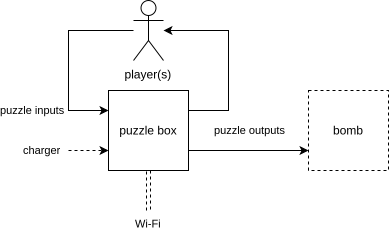
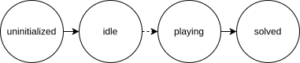

:document: Software Design
include::share/meta.adoc[]

== Introduction

This document contains all the design considerations made for the separate
software components that make up the puzzle box. This document has a top-down
structure, and has three levels of design 'depth':

. Top-level (hardware diagrams, OSes, communication buses, etc.)
. Module-level (puzzle inputs/outputs, top-level software diagram, etc.)
. Component-level (software dependencies, game state, etc.)

Only design details deemed relevant by the document authors are documented
here. Low-level implementation details such as API interfaces, code paths and
workarounds are documented inside the source code repository.

[[sec:lv1]]
== Top-Level

This section of the design document establishes the development target
hardware. It also specifies the modules that are elaborated further in
<<sec:lv2>>.

<<fig:system-top>> shows a block diagram that describes the context in which
the puzzle box is used. The puzzle box in this diagram internally consists of a
main controller and multiple puzzle modules. Other notable details include:

* The charger is removable, and the puzzle box is intended to be used as a
  battery-powered device (i.e. not while tethered).
* Puzzle outputs are used to complete a feedback loop (gameplay) with the
  players, as well as eventually provide a solution to diffuse a bomb. This
  bomb is part of a standalone project that has already been finished at the
  time of writing (2024-03-11), and this project only describes the interface
  between the puzzle box and the bomb.
* The puzzle box is capable of bidirectional communication over Wi-Fi. This
  connection is used to configure the puzzle box before gameplay or modify its
  state during gameplay.

[[fig:system-top]]
.Context block diagram

The rest of this section details the internal hardware modules and the
separation of functionality of these modules.

=== Puzzle Modules

The puzzle box hardware produced by the 21-22 group consists of 6 sides, 4 of
which are utilized by puzzle modules. This section defines the properties of a
puzzle module.

Puzzle modules can occupy one or more physical sides of the puzzle box to
implement the physical interface required for a puzzle or game. In order to
realize a complete game, each of these puzzle modules must have the ability to
control game inputs and outputs. Two approaches for this were considered:

. Let the main controller handle game state and logic for all puzzle modules.
+
This approach has the main benefit of allowing puzzle module controllers to be
substituted for I^2^C I/O expanders that draw less power than a complete MCU.
+
The major drawback of this approach is that the main controller's software
needs to be configured for each different hardware configuration, which makes
the main controller software more complicated.

. Design an abstract 'game interface' and give each puzzle module its own MCU.
+
This approach provides the most flexibility, as the main controller's software
is no longer dependent on the physically installed hardware. This approach is
also favorable with regards to testability, as each puzzle module can run
standalone.
+
The main drawback of this approach is the possible increase in power
consumption, as each puzzle module now must have its own MCU for managing game
state and communication with the main controller.

The current hardware (developed by the 21-22 group) uses the second approach,
though with MCUs that were not designed for power efficiency. This year
(23-24), the hardware produced by the 21-22 group was utilized due to the 23-24
group not including students from the hardware study path. Minimizing power
draw for each puzzle module is still a priority, so a different microcontroller
was selected.

The criteria for a puzzle module controller are:

* Must have an I^2^C peripheral (<<reqs.adoc#req:pm-i2c-ctrl>>).
* Should have enough I/O ports to directly control moderately complex puzzles
  (<<reqs.adoc#req:pm-gpio>>).
* Should be power efficient (<<reqs.adoc#req:pm-pwr-efficient>>).

The research document cite:[research] compares various microcontrollers
matching these criteria. As a result of this research, the Microchip
PIC16F15276 was selected as the recommended microcontroller for future puzzle
modules. The current development hardware utilizes an ESP32-PICO-D4 module, so
the puzzle module software is written with portability in mind.

[[fig:puzzle-module-top]]
.Generic puzzle module top-level block diagram
image::img/puzzle-module-top.svg[]

<<fig:puzzle-module-top>> shows a block diagram of how most puzzle modules are
implemented. Since the internal components of the puzzle module block from
<<fig:puzzle-module-top>> differ for each puzzle, they are left out in this
section. <<sec:lv2>> includes the next detail level for all of the implemented
puzzles this year. The puzzle bus is detailed further in
<<sec:lv1-communication>>.

=== Main Controller

This section describes the responsibilities of the main controller inside the
puzzle box. The main controller is a central processor that is responsible for
the following:

* Integrate installed puzzle modules to form a cohesive experience by—
** Detecting and initializing installed puzzle modules.
** Aggregating game state for all installed puzzle modules.
** Reading and writing game state for all installed puzzle modules.
** Broadcasting updates internally.
* Serve TCP socket connections for—
** Sending state updates
** Manually updating game state
** Integration with the bomb

The specific requirement of being able to serve TCP socket connections was
created so this year's puzzle box could keep compatibility with the software
produced by the 21-22 group.

As mentioned in the research document cite:[research], the 21-22 group produced
the hardware that is used as development target for this year's (23-24) run of
the puzzle box project. The existing hardware utilizes a Raspberry Pi 3B+ as
main controller, but this controller caused issues with power consumption
cite:[2122_handover]. Choosing a different controller during development
requires significant refactoring, so a different main controller has been
selected at the start of this year's run of the puzzle box project.

The criteria for the main controller are:

* Must have an I^2^C peripheral (<<reqs.adoc#req:main-i2c-ctrl>>).
* Must be able to connect to a standard 802.11b/g/n access point
  (<<reqs.adoc#req:main-802-11-ap>>).
* Must be able to serve TCP socket connection(s)
  (<<reqs.adoc#req:main-tcp-socket>>).
* Should be power efficient (<<reqs.adoc#req:main-pwr-efficient>>).

The requirements document compares various microcontrollers that fit these
criteria. After this comparison, the decision was made to utilize the Raspberry
Pi Pico W as main controller during development.

[[fig:main-controller-top]]
.Main controller top-level block diagram

<<fig:main-controller-top>> shows a block diagram of the main controller and
its inputs and outputs. The main controller is the only module in the puzzle
box that is able to communicate over Wi-Fi and is therefore responsible for all
communication between the puzzle box and game operator. The puzzle bus is
detailed further in <<sec:lv1-communication>>.

[[sec:lv1-communication]]
=== Communication

Communication between puzzle modules, the main controller and other auxiliary
peripherals is handled through a central I^2^C bus referred to as the 'puzzle
bus'. This design was again carried over from the hardware design from the
21-22 group cite:[2122_design].

The only notable difference made this year was the removal of the
"HarwareInterrupt" line1{empty}footnote:[This is not a typo], which was
connected but not utilized cite:[research].

Address definitions and protocol specifications are further detailed in
<<sec:lv2-bus>>.

=== Power supply

One of the user requirements is that the puzzle box runs on battery power
(<<reqs.adoc#req:pwr-battery>>). Due to the team composition of this year's
(23-24) run of the puzzle box project, a new power supply was not chosen, even
though the current power supply was determined insufficient by the 21-22 group.
This year, additional requirements were specified for the power supply, which
were used when selecting MCUs suitable for battery-powered applications.

[[fig:power-supply-top]]
.Power supply module top-level block diagram
image::img/power-supply-top.svg[]

<<fig:puzzle-module-top>> shows a block diagram of how most puzzle modules are
implemented. Besides the additional requirements, the power supply remains the
same, and will not be elaborated further on in this document.

=== Overview

<<fig:system-bus>> is the resulting combination of the modules from
<<fig:puzzle-module-top>>, <<fig:main-controller-top>> and
<<fig:power-supply-top>>.

[[fig:system-bus]]
.Hardware component overview

[[sec:lv2]]
== Modules

This section elaborates on the top-level specifications from <<sec:lv1>> with
additional hardware specifications and software design decisions.

=== Puzzle Module Framework

This subsection defines aspects of the 'puzzle framework' and the interface
that allows puzzle modules to integrate with this framework. All communication
described within this subsection refers to 'internal' communication between the
main controller and puzzle module.

The puzzle framework is the foundation of the puzzle box software, and is
designed to facilitate the following:

* Allow puzzle modules to be swapped with minimal downtime or maintenance
  (<<reqs.adoc#req:pm-swap>>).
* Simplify the development process and integration of new puzzle modules
  (<<reqs.adoc#req:main-static>>).
* Provide abstracted interfaces to allow for easy integration of the puzzle box
  as part of a larger whole (<<reqs.adoc#req:main-interface>>).

[[sec:framework-state]]
==== State

All puzzle modules implement the same state machine shown in
<<fig:puzzle-module-common-state>>. Note that the arrows indicate state
transitions that a puzzle module may take on its own. The main controller also
allows the game operator to manually set the current state as one of the states
on the right half of <<fig:puzzle-module-common-state>>, which can be used to
skip a puzzle if a player is stuck (<<reqs.adoc#req:edge-skip-puzzle>>) or
reset a game if it is malfunctioning (<<reqs.adoc#req:edge-manual-reset>>).

Puzzle modules start in the 'uninitialized' state, where they repeatedly send
messages to the main controller (see <<sec:main-bridge>>). The state transition
from 'uninitialized' to 'reset' is forced by the main controller upon
initialization. States on the right half of <<fig:puzzle-module-common-state>>
are used during gameplay.

[[fig:puzzle-module-common-state]]
.Global puzzle module state machine

The state machine described in <<fig:puzzle-module-common-state>> is referred
to as the global state. Puzzle modules may also declare and define custom state
variables, which is referred to as auxiliary state. These auxiliary state
variables contain game-specific variables; e.g. the binary state of each button
on the Neotrellis puzzle module, or the last passcode entered on the vault
puzzle module.

Separating the auxiliary state from the generic state allows the main
controller to handle the auxiliary state as an arbitrary blob, which allows for
future expansion without modification of the main controller software.

==== Commands

The puzzle module framework describes the following commands:

* Read state
* Write state
* Update

The 'read' and 'write' commands are used to communicate both types of state
defined in <<sec:framework-state>>.

To avoid issues caused by state synchronization memory consumption on the main
controller and puzzle modules, auxiliary state is only stored on each
respective puzzle module's controller. Only global state is cached on the main
controller to reduce the number of back-and-forth messages required for state
updates.

These commands are sufficient to realize the puzzle box, but this means that
the puzzle box would rely heavily on polling-based updates internally. To solve
this, the 'update' command was created. This command is utilized for various
kinds of updates, including registering new puzzle modules and updating global
state.

=== Main Controller

This subsection defines the function and state of the main controller.

==== State

The global state of the main controller is an aggregated version of all
installed puzzle modules and is defined by the state machine shown in
<<fig:main-controller-state>>.

[[fig:main-controller-state]]
.Main controller global state machine
image::img/main-controller-state.svg[]

The following list describes when each state is active:

* If all puzzle modules are in the 'reset' state, the main controller is also
  in the 'reset' state.
* If all puzzle modules are in the 'solved' state, the main controller is also
  in the 'solved' state.
* Else, the main controller is in the 'playing' state.

Because the main controller's state is only dependent on the installed puzzle
modules' state, it is only updated when a puzzle module sends an update
notification. When the global state of the main module changes, an update
broadcast is sent to all puzzle modules.

To simplify the commands used to control the puzzle box, the list of installed
puzzle modules is stored as an auxiliary state variable of the main controller.

==== Initializing Puzzle Modules

Puzzle modules start in the 'uninitialized' state (see
<<fig:puzzle-module-common-state>>). In this state, the puzzle module
repeatedly sends an update command to the main controller. The main controller
responds to this message by sending a 'set state' command with the target state
as 'reset' as reply. Before this response is sent, the main controller
internally adds the bus address of the puzzle module requesting to be
initialized to the list of installed puzzle modules. From the main controller's
point of view, this reply marks the moment the initialization is complete.

[[fig:sequence-puzzle-module-init]]
.Puzzle module initialization sequence diagram
image::img/sequence-puzzle-module-init.svg[]

(Activated lifeline indicates the module is no longer in 'uninitialized' state)

[[sec:main-bridge]]
==== Bridge

The bridge is used to remotely access and control the puzzle box.

The Raspberry Pi 3B+ used as main controller during the 21-22 run of the
project set up a Wi-Fi Mesh network cite:[2122_design] to communicate with the
puzzle box. This year's main controller (Raspberry Pi Pico W cite:[research])
uses a standard 802.11b/g/n access point instead
(<<reqs.adoc#req:main-802-11-ap>>).

On this network, the main controller hosts a server that serves TCP socket
connections. These sockets directly forward all internal messages sent to the
main controller bidirectionally (i.e. on behalf of the main controller).
Detailed specifications on the TCP socket server are in
<<sec:lv3-remote-control>>.

==== Operating System

The research document cite:[research] contains a detailed comparison of various
operating systems that are suitable to realize the functionality described in
this section. After this comparison, the decision was made to utilize FreeRTOS
as the operating system on the Rasberry Pi Pico W.

[[sec:lv2-bus]]
=== Puzzle Bus

This section describes the addresses and communication protocol used on the
puzzle bus. These specifications only apply to messages sent internally in the
puzzle box, as messages forwarded by the bridge (see <<sec:main-bridge>>) are
sent on behalf of the main controller.

==== Addresses

The I^2^C addresses remain mostly unchanged from the 20-21 group's
implementation cite:[2021_design]. Addresses that were modified since the 20-21
implementation are marked with an asterisk. Table 1 lists these addresses for
reference. These addresses are also used to identify specific puzzle modules.

.I^2^C address reference
[%autowidth]
|===
| Peripheral | Address

| Main controller | 0x10*
| Neotrellis puzzle controller | 0x11*
| Neotrellis button matrix | 0x12*
| Software puzzle controller | 0x03
| Hardware puzzle controller | 0x04
| Vault puzzle controller | 0x06
|===

==== Messages

All messages sent over the puzzle bus have a similar format. This format is
shown in Table 2. Notable details include:

The 'subject' field does not have to match the I^2^C address of the message
sender or recipient

Property 0x00 stores a module's global state

.Puzzle bus message format
[%autowidth]
|===
| Field | Content

| Command | Enum: read, write, update
| Subject | I^2^C address (7-bit)
| Property | Address (8-bit)
| Value | Byte string (variable length)
|===

The messages described in Table 2 are (de)serialized using Google's protocol
buffer library. This choice was made after considering various alternative
options for sending structured messages cite:[research].

<<fig:sequence-puzzle-module-init>> shows an example of how messages are
exchanged for the initialization of a puzzle module.

<<fig:sequence-puzzle-finish>> shows an example exchange where the last puzzle
module (A) is solved while (B) is already solved.

. First, module A sets it's own state to 'solved' and subsequently informs the
  main controller of this change.
. As a result of this update notification, the main controller queries puzzle
  module A for its new global state.
. Once the main controller has received and confirmed that all puzzle module
  global states are set to 'solved', the main controller sets its own state to
  'solved', and broadcasts an update message to all puzzle modules.
. As a result of the update message from the main controller, module B requests
  the main controller's new global state, and is able to verify that all puzzle
  modules have been solved.

In this example, module B could be the vault puzzle module, which displays a
code when the entire puzzle box is solved.

[[fig:sequence-puzzle-finish]]
.Puzzle box finish sequence diagram

=== NeoTrellis Puzzle

This subsection defines aspects of the 'NeoTrellis puzzle' module and gives a
summary of how the puzzle is meant to be solved. This module will be created to
facilitate the NeoTrellis puzzle game logic and communication with the main
controller about the puzzle state.

==== NeoTrellis puzzle gameplay

The NeoTrellis puzzle is an 8x8 button matrix with Neopixels underneath each
button. The way to solve this puzzle is by dimming every Neopixel in the 8x8
matrix. This is done by clicking on a button, which switches the state of the
Neopixel underneath the pixel and the Neopixels in each cardinal direction from
the pressed button. This means that if a Neopixel was on and the button was
pressed it will turn off and vice-versa. A visual example can be found in
Appendix B.

==== Puzzle inputs & outputs

The inputs and outputs of this puzzle have been taken from the design document
of the previous group which worked on this project (??). This input and output
diagram has been shown in <<fig:neotrellis-io>>.

[[fig:neotrellis-io]]
.NeoTrellis puzzle in-out

=== Software Puzzle

This subsection defines aspects of the 'software puzzle' module and gives a
summary of how the puzzle is meant to be solved. This module will be created to
facilitate the software puzzle game logic and communication with the main
controller about the software puzzle state.

[[sec:software-gameplay]]
==== Software puzzle gameplay

The software puzzle consists of 12 input ports which can be connected using a
banana plug connector. The 6 input ports on the left side of the puzzle each
have their own logical circuit engraved in the box, and the 6 input ports on
the right side of the puzzle have a letter (A through F) engraved in the box.
The way to solve the puzzle is by connecting the banana plug cable from an
input port on the left side of the puzzle to the corresponding input port on
the right side of the puzzle. An example of this can be found in Appendix C.

When the puzzle starts, the participants of the game will have 6 code-fragments
written on paper, corresponding to the logical circuits on the puzzle box. The
bomb participants will have description of the C-code fragments, while the
puzzle box participants only have the logical circuits on the puzzle box. The
participants must communicate with each other to figure out which a fragment of
C code corresponds with a logical circuit engraved on the puzzle box. Once this
has been done the puzzle box participants can use a banana plug cable to
connect the input and output to each other. Once the correct combination of
logical gates with the correct letter is made, the puzzle is solved (shown by
an LED lighting up above the puzzle). Allowing the participants to both see a
binary code using 16 LEDs above the puzzle, and to continue to the next puzzle.

==== Puzzle inputs & outputs

As stated in <<sec:software-gameplay>> the puzzle has 12 inputs, as well as an
LED which shows whether the puzzle has been solved and 16 LEDs showing a binary
code. This is shown in <<fig:software-io>>.

[[fig:software-io]]
.Software puzzle in-out

=== Hardware Puzzle

==== Hardware Puzzle gameplay

The hardware puzzle has a logic gate puzzle engraved on the front plate of the
puzzle box. To solve the puzzle, the user must set the toggle switches to the
correct position. To solve the puzzle, a truth table is used.

The second part of the puzzle is unlocked after solving the logic gate puzzle,
the user has to listen to a Morse code from which a four-digit code follows.
The user then turns potentiometers to change this code on the display. The
puzzle is solved when the user has put the correct code on the display. Once
successful, the indicator LED will light up.

==== Puzzle inputs / outputs

The inputs and outputs of this puzzle have been taken from the design document
of the previous group which worked on this project (21-22). This input and
output diagram has been shown in Figure ??.

=== Vault Puzzle

==== Vault puzzle gameplay

The vault puzzle is a puzzle created to test the communication skills of the
student. It shows a code on the puzzle box, which then needs to be given to
students with the game manual, who communicates this to the students at the
puzzle box the button they must click. This needs to be done 5 times before the
vault opens and the last code is given to defuse the bomb if a wrong button is
clicked the vault resets and they need to start over from the beginning.

==== Puzzle inputs & outputs

[[fig:vault-io]]
.Vault puzzle in-out
image::img/vault-io.png[]

=== Bomb device

==== Bomb device connection

The bomb connects to a WiFi-network using the 802.11x standard. The hub hosts
an interface that can be used to identify all the devices including the bomb
and also pair it to a puzzlebox. After that the game can be set-up and a given
countdown time and start time will be communicated to the bomb over a TCP
socket connection. The hub generates a code that will be send to both the
puzzlebox and bomb so that both devices know what would be or can be expected.

The bomb can also use the WiFi connection to sync. the time.

==== Device inputs & outputs

[[fig:bomb-io]]
.Bomb device in-out

== Components
[[sec:lv3-remote-control]]
=== Remote Control
==== Socket Server
==== Socket Commands
=== Neotrellis Puzzle
=== Game state diagrams, activity diagrams (if applicable)
=== Software Puzzle
=== Hardware Puzzle
=== Vault Puzzle

[appendix]
== NeoTrellis puzzle example

[appendix]
== Software puzzle example

include::share/footer.adoc[]
