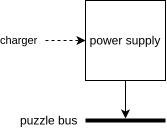

:document: Software Design
include::share/meta.adoc[]

== Introduction

This document contains all the design considerations made for the separate
software components that make up the puzzle box. This document has a top-down
structure, and has three levels of design 'depth':

. Top-level (hardware diagrams, OSes, communication buses, etc.)
. Module-level (puzzle inputs/outputs, top-level software diagram, etc.)
. Component-level (software dependencies, game state, etc.)

Only design details deemed relevant by the document authors are documented
here. Low-level implementation details such as API interfaces, code paths and
workarounds are documented with Doxygen cite:[pbdox].

[[sec:lv1]]
== Top-Level

This section of the design document establishes the development target
hardware. It also specifies the modules that are elaborated further in
<<sec:lv2>>.

<<fig:system-top>> shows a block diagram that describes the context in which
the puzzle box is used. The puzzle box in this diagram internally consists of a
main controller and multiple puzzle modules. Other notable details include:

* The charger is removable, and the puzzle box is intended to be used as a
  battery-powered device (i.e. not while tethered).
* Puzzle outputs are used to complete a feedback loop (gameplay) with the
  players, as well as eventually provide a solution to diffuse a bomb. This
  bomb is part of a standalone project that has already been finished at the
  time of writing (2024-03-11), and this project only describes the interface
  between the puzzle box and the bomb.
* The puzzle box is capable of bidirectional communication over Wi-Fi. This
	connection is used to configure the puzzle box before gameplay or modify its
	state during gameplay (<<reqs.adoc#req:edge-manual-reset>>,
	<<reqs.adoc#req:edge-skip-puzzle>>).

[[fig:system-top]]
.Context block diagram
image::img/system-top.svg[]

The rest of this section details the internal hardware modules and the
separation of functionality of these modules.

=== Puzzle Modules

The puzzle box hardware produced by the 21-22 group consists of 6 sides, 4 of
which are utilized by puzzle modules. This section defines the properties of a
puzzle module.

Puzzle modules can occupy one or more physical sides of the puzzle box to
implement the physical interface required for a puzzle or game. In order to
realize a complete game, each of these puzzle modules must have the ability to
control game inputs and outputs. Two approaches for this were considered:

. Let the main controller handle game state and logic for all puzzle modules.
+
This approach has the main benefit of allowing puzzle module controllers to be
substituted for I^2^C I/O expanders that draw less power than a complete MCU.
+
The major drawback of this approach is that the main controller's software
needs to be configured for each different hardware configuration, which makes
the main controller software more complicated.

. Design an abstract 'game interface' and give each puzzle module its own MCU.
+
This approach provides the most flexibility, as the main controller's software
is no longer dependent on the physically installed hardware. This approach is
also favorable with regards to testability, as each puzzle module can run
standalone.
+
The main drawback of this approach is the possible increase in power
consumption, as each puzzle module now must have its own MCU for managing game
state and communication with the main controller.

The current hardware (developed by the 21-22 group) uses the second approach,
though with MCUs that were not designed for power efficiency. This year
(23-24), the hardware produced by the 21-22 group was utilized due to the 23-24
group not including students from the hardware study path. Minimizing power
draw for each puzzle module is still a priority, so a different microcontroller
was selected.

The criteria for a puzzle module controller are:

* Must have an I^2^C peripheral (<<reqs.adoc#req:pm-i2c-ctrl>>).
* Should have enough I/O ports to directly control moderately complex puzzles
  (<<reqs.adoc#req:pm-gpio>>).
* Should be power efficient (<<reqs.adoc#req:pm-pwr-efficient>>).

The research document cite:[research] compares various microcontrollers
matching these criteria. As a result of this research, the Microchip
PIC16F15276 was selected as the recommended microcontroller for future puzzle
modules.

NOTE: The current development hardware still utilizes an ESP32-PICO-D4 module,
but due to a misunderstanding cite:[handover], Arduino boards were used to
implement the puzzle modules.

[[fig:puzzle-module-top]]
.Generic puzzle module top-level block diagram

<<fig:puzzle-module-top>> shows a block diagram of how most puzzle modules are
implemented. Since the internal components of the puzzle module block from
<<fig:puzzle-module-top>> differ for each puzzle, they are left out in this
section. <<sec:lv2>> includes the next detail level for all of the implemented
puzzles this year. The puzzle bus is detailed further in
<<sec:lv1-communication>>.

=== Main Controller

This section describes the responsibilities of the main controller inside the
puzzle box. The main controller is a central processor that is responsible for
the following:

* Integrate installed puzzle modules to form a cohesive experience by—
** Detecting and initializing installed puzzle modules.
** Aggregating game state for all installed puzzle modules.
** Reading and writing game state for all installed puzzle modules.
** Broadcasting updates internally.
* Serve a TCP socket for—
** Sending state updates
** Manually updating game state
** Integration with the bomb

The specific requirement of being able to serve TCP socket connections was
created so this year's puzzle box could keep compatibility with the software
produced by the 21-22 group.

As mentioned in the research document cite:[research], the 21-22 group produced
the hardware that is used as development target for this year's (23-24) run of
the puzzle box project. The existing hardware utilizes a Raspberry Pi 3B+ as
main controller, but this controller caused issues with power consumption
cite:[2122_handover]. Choosing a different controller during development
requires significant refactoring, so a different main controller has been
selected at the start of this year's run of the puzzle box project.

The criteria for the main controller are:

* Must have an I^2^C peripheral (<<reqs.adoc#req:main-i2c-ctrl>>).
* Must be able to connect to a standard 802.11b/g/n access point
  (<<reqs.adoc#req:main-802-11-ap>>).
* Must be able to serve TCP socket connection(s)
  (<<reqs.adoc#req:main-tcp-socket>>).
* Should be power efficient (<<reqs.adoc#req:main-pwr-efficient>>).

The requirements document compares various microcontrollers that fit these
criteria. After this comparison, the decision was made to utilize the Raspberry
Pi Pico W as main controller during development.

NOTE: This was written while we did not know the puzzle bus specifically
requires slave-addressible I^2^C multi-master controllers to function properly.
The RP2040 was still used, but has required implementing workarounds. Please
see the handover report for more details on how this impacted the project
cite:[handover].

[[fig:main-controller-top]]
.Main controller top-level block diagram
image::img/main-controller-top.svg[]

<<fig:main-controller-top>> shows a block diagram of the main controller and
its inputs and outputs. The main controller is the only module in the puzzle
box that is able to communicate over Wi-Fi and is therefore responsible for all
communication between the puzzle box and game operator. The puzzle bus is
detailed further in <<sec:lv1-communication>>.

[[sec:lv1-communication]]
=== Communication

Communication between puzzle modules, the main controller and other auxiliary
peripherals is handled through a central I^2^C bus referred to as the 'puzzle
bus'. This design was again carried over from the hardware design from the
21-22 group cite:[2122_design].

The previously specified "HarwareInterrupt" line1{empty}footnote:[This is not a
typo] has been removed this year, as it was connected but not utilized
cite:[research].

To optimize for flexibility and extensibility, the puzzle bus should ideally
function as a network (similar to the CAN bus), to allow puzzle modules to send
responses asynchronously. I^2^C was initially chosen for the puzzle bus due to
its widespread availability on microcontrollers and in peripherals, but does
not provide any network-like capabilities.

To archive network-like capabilities, the puzzle bus is specified to be a
multi-master I^2^C bus, and all puzzle modules are specified to be I^2^C
multi-master controllers that are slave-addressible. The multi-master part is
required to prevent I^2^C transmissions from being corrupted in the event of a
bus collision, and the slave-addressible part is required to both send and
receive messages on the same controller. This can also be achieved by using 2
I^2^C peripherals on the same bus simultaniously, which is what the RP2040
currently uses. This has required changes to the wiring, and is the only
hardware-level specification made this year.

More details on the messages sent over the puzzle bus are described in
<<sec:lv3-pb-messages>>.

=== Power supply

One of the user requirements is that the puzzle box runs on battery power
(<<reqs.adoc#req:pwr-battery>>). Due to the team composition of this year's
(23-24) run of the puzzle box project, a new power supply was not chosen, even
though the current power supply was determined insufficient by the 21-22 group.
This year, additional requirements were specified for the power supply, which
were used when selecting MCUs suitable for battery-powered applications.

[[fig:power-supply-top]]
.Power supply module top-level block diagram

<<fig:puzzle-module-top>> shows a block diagram of how most puzzle modules are
implemented. Besides the additional requirements, the power supply remains the
same, and will not be elaborated further on in this document.

=== Overview

<<fig:system-bus>> is the resulting combination of the modules from
<<fig:puzzle-module-top>>, <<fig:main-controller-top>> and
<<fig:power-supply-top>>.

[[fig:system-bus]]
.Hardware component overview
image::img/system-bus.svg[]

[[sec:lv2]]
== Modules

This section elaborates on the top-level (hardware) specifications from
<<sec:lv1>> with software design decisions.

=== Software module separation

[[fig:software-component]]
.Software library components
image::img/software-components.svg[]

<<fig:software-component>> shows a software component diagram with an example
Arduino-based puzzle module, the main controller and the puzzle box client.
Notable properties of this architecture include:

* The Arduino SDK, FreeRTOS, mpack, and RPI Pico SDK are external libraries,
	and with the exception of mpack, these have not been modified.
* The puzzle bus driver is split into a (portable) standalone library and a
	module-specific driver.
* There is a separate library for (de)serializing I^2^C commands for
	transmission over TCP.

The specific decision to split the puzzle bus driver and create a separate
I^2^C over TCP library was made to avoid writing a command set separate from
internal puzzle bus commands (i.e. one specific to TCP connections). This
architecture allows the puzzle box client to not only control the main
controller, but also directly inspect puzzle bus messages for debugging and
development of future puzzle modules (<<reqs.adoc#req:main-static>>).

=== Puzzle module framework

This subsection defines aspects of the 'puzzle framework': the interface that
allows puzzle modules to integrate with the puzzle bus and main controller. All
communication described within this subsection refers to 'internal'
communication between the main controller and puzzle modules on the puzzle bus.

The puzzle framework is the foundation of the puzzle box software, and is
designed to facilitate the following:

* Allow puzzle modules to be swapped with minimal downtime or maintenance
  (<<reqs.adoc#req:pm-swap>>).
* Simplify the development process and integration of new puzzle modules
  (<<reqs.adoc#req:main-static>>).
* Provide abstracted interfaces to allow for easy integration of the puzzle box
  as part of a larger whole (<<reqs.adoc#req:main-interface>>).

==== Guidelines

The following assumptions are made about puzzle modules:

* Puzzle modules do not take initiative to send REQ or SET commands. They only
	respond to requests from the main controller.
* Puzzle modules are I^2^C multi-master controllers that are slave-addressable
	in master mode.
* The main controller is a puzzle module, but with the following differences:
** The main controller is allowed to initiate REQ and SET commands.
** The main controller's global state is an aggregation of all other puzzle
	 modules, and ignores STATE SET commands.

These guidelines allow the following simplifications:

* Puzzle modules may assume they are always being addressed by the main
	controller (this simplifies the message architecture).
* The puzzle bus may be shared with regular I^2^C peripherals without causing
	issues.

[[sec:lv3-pb-messages]]
==== Messages

Puzzle bus messages consist of a simple header and variable data. This format
is shown in <<tab:pb-msg-fmt>>. The messages are (de)serialized using mpack.
This choice was made after considering various alternative options for sending
structured messages cite:[research]. Note that all messages are sent as I^2^C
writes. Due to this, the I^2^C address of a message sender is included in the
header to facilitate network-like features over I^2^C.

[[tab:pb-msg-fmt]]
.Puzzle bus message format
[%autowidth]
|===
| Field | Content

| type | Command type (see <<tab:pb-msg-types>>)
| action | Command action (see <<tab:pb-msg-actions>>)
| sender | I^2^C address of sender
| cmd | Command data (dependent on ``type``)
|===

<<tab:pb-msg-types>> lists the different command types.

[[tab:pb-msg-types]]
.Puzzle bus command types
[cols="10,~"]
|===
| Type | Description

| ``MAGIC``
| The MAGIC command effectively serves as a 'secret handshake' (using a _magic_
value) which is used to distinguish between puzzle modules and unrelated I^2^C
devices.

| ``STATE``
| The STATE command is used by puzzle modules to inform the main controller about
their global state (see <<sec:framework-state>>). The main controller
aggregates the states of all connected puzzle modules and exchanges this
aggregated state with the puzzle modules to indicate when the entire puzzle box
is solved.

| ``PROP``
| The PROP command type is used for exchanging arbitrary data between puzzle
modules and/or the puzzle box client (pbc) over the <<sec:main-bridge,TCP
bridge>>. These properties are not used by the puzzle framework, and serve as
an extensible interface for puzzle module developers to use.
|===

<<tab:pb-msg-actions>> lists the different command actions.

[[tab:pb-msg-actions]]
.Puzzle bus command actions
[cols="10,~"]
|===
| ``REQ``
| Mark the command as a request. The receiver of this message is expected to
return a message of the same type, but with a RES action.

| ``RES``
| Mark the command as a response to a REQ message. All REQ messages should be
followed by a RES message.

| ``SET``
| Request a change / write. The SET command is never followed by a RES.
|===

Please note that not all commands define behavior for all actions (e.g. there
is no MAGIC SET command).

Only the MAGIC and STATE commands are required for the puzzle box to function.
The PROP command was created to allow future expansion without modifying the
main controller firmware (<<reqs.adoc#req:main-static>>).

The specific format of the 'cmd' field from <<tab:pb-msg-fmt>> is different for
each command type, and is for this reason only documented in-code using
Doxygen cite:[pbdox].

[[sec:framework-state]]
==== State

All puzzle modules implement the same state machine shown in
<<fig:puzzle-module-common-state>>. Note that continuous arrows indicate state
transitions that a puzzle module may take on its own, while dashed arrows
indicate state transitions forced by the main controller. The main controller
also allows the game operator to manually set a module's global state to one of
these states, which can be used to skip a puzzle if a player is stuck
(<<reqs.adoc#req:edge-skip-puzzle>>) or reset a game if it is malfunctioning
(<<reqs.adoc#req:edge-manual-reset>>).

[[fig:puzzle-module-common-state]]
.Global puzzle module state machine
image::img/puzzle-module-common-state.svg[]

Puzzle modules start in the 'uninitialized' state, where they wait until the
main controller sends a REQ STATE command. Receiving this command indicates to
the puzzle module that it was successfully registered by the main controller,
and that it may transition from the 'uninitialized' state to the 'idle' state.
This process is also shown in <<fig:sequence-puzzle-module-init>>.

The state machine described in <<fig:puzzle-module-common-state>> is referred
to as the global state. Puzzle modules may also declare and define custom
variables, which are referred to as properties. These properties may contain
game-specific variables; e.g. the binary state of each button on the Neotrellis
puzzle module, or the last passcode entered on the vault puzzle module.

Separating properties from the global state allows the main controller to
handle these property values as an arbitrary blob, which allows for future
expansion without modification of the main controller software
(<<reqs.adoc#req:main-static>>).

==== I^2^C addresses

The RPI Pico SDK prohibits the use of I^2^C addresses reserved by the I^2^C
specification. This means different addresses from previous years are used.
These addresses are indexed in the code in a header exposed by the puzzle bus
driver cite:[pbdox].

The I^2^C addresses are also used to determine the puzzle sequence (i.e. the
order in which puzzle modules are set to the 'playing' state). The sequence is
determined by the main controller on startup, and consists of the connected
puzzle modules' addresses in descending order (i.e. highest address first).
Note that the same I^2^C address may be used by two different puzzle modules,
but this will make it impossible for them to be used simultaniously.

=== Main Controller

This subsection defines the function and state of the main controller.

==== Initializing puzzle modules

The main controller sends a MAGIC REQ command to every I^2^C address on
startup. Puzzle modules start in the 'uninitialized' state (see
<<fig:puzzle-module-common-state>>), during which they do nothing. Puzzle
modules in this state are still able to reply to requests, including MAGIC REQ
commands. When the main controller receives a MAGIC RES command, the I^2^C
address of the sender is added to an internal list of I^2^C devices that are
considered puzzle modules.

After the initial handshake request 'wave' (bus scan), all puzzle modules are
repeatedly asked for their global state using a STATE REQ command. This request
also includes the global state of the requesting puzzle module, which is always
the main controller (under normal circumstances). Upon receiving the first
STATE REQ command, a puzzle module knows it has been registered successfully by
the main controller, and transitions into the 'idle' state.

[[fig:sequence-puzzle-module-init]]
.Puzzle module initialization sequence diagram
image::img/sequence-puzzle-module-init.svg[]

(Activated lifeline indicates the module is no longer in 'uninitialized' state)

==== State

The global state of the main controller is an aggregation of all installed
puzzle modules and is defined by the state machine shown in
<<fig:main-controller-state>>.

[[fig:main-controller-state]]
.Main controller global state machine

The main controller global state is determined using the following rules:

* If all puzzle modules are in the 'idle' state, the main controller is also in
	the 'idle' state.
* If all puzzle modules are in the 'solved' state, the main controller is also
	in the 'solved' state.
* Else, the main controller is in the 'playing' state.

Due to the repeated STATE REQ commands, this effectively informs the puzzle
modules when the puzzle box is completely solved.

[[sec:main-bridge]]
==== Bridge

The bridge is used to remotely access and control the puzzle box.

The Raspberry Pi 3B+ used as main controller during the 21-22 run of the
project set up a Wi-Fi Mesh network cite:[2122_design] to communicate with the
puzzle box. This year's main controller (Raspberry Pi Pico W cite:[research])
uses a standard 802.11b/g/n access point instead
(<<reqs.adoc#req:main-802-11-ap>>) as it is a simpler solution.

On this network, the main controller hosts a server that serves a TCP socket
connection. This socket is used to directly forward all internal messages sent
on the puzzle bus to the puzzle box client bidirectionally (on behalf of the
main controller).

Due to the separation of the puzzle bus driver code into a standalone library
for reading/writing puzzle bus commands, and a puzzle module-specific code, the
puzzle box client is able to read/write raw I^2^C commands directly. A separate
library was made for serializing I^2^C messages so they can be sent over the
TCP connection. This library is documented in detail using Doxygen cite:[pbdox].

==== Operating system

Because the main controller needs to asynchronously handle state exchanges with
puzzle modules while serving a TCP socket connection, the decision to use a
task scheduler was made. Due to the requirement that most software should be
covered by the standard curriculum (<<reqs.adoc#req:curriculum-cov>>), this
choice was between FreeRTOS and Zephyr. FreeRTOS was chosen because it is the
simplest solution, and because the features Zephyr offers over FreeRTOS are
already present in the Raspberry Pi Pico SDK.

=== NeoTrellis puzzle

This subsection defines aspects of the 'NeoTrellis puzzle' module and gives a
summary of how the puzzle is meant to be solved. This module will be created to
facilitate the NeoTrellis puzzle game logic and communication with the main
controller about the puzzle state.

==== NeoTrellis puzzle gameplay

The NeoTrellis puzzle is an 8x8 button matrix with Neopixels underneath each
button. The way to solve this puzzle is by dimming every Neopixel in the 8x8
matrix. This is done by clicking on a button, which switches the state of the
Neopixel underneath the pixel and the Neopixels in each cardinal direction from
the pressed button. This means that if a Neopixel was on and the button was
pressed it will turn off and vice-versa.
// A visual example can be found in Appendix B.

==== Puzzle inputs & outputs

The inputs and outputs of this puzzle have been taken from the design document
of the previous group which worked on this project (??). This input and output
diagram has been shown in <<fig:neotrellis-io>>.

[[fig:neotrellis-io]]
.NeoTrellis puzzle in-out
image::img/neotrellis-io.png[]

=== Software puzzle

This subsection defines aspects of the 'software puzzle' module and gives a
summary of how the puzzle is meant to be solved. This module will be created to
facilitate the software puzzle game logic and communication with the main
controller about the software puzzle state.

[[sec:software-gameplay]]
==== Software puzzle gameplay

The software puzzle consists of 12 input ports which can be connected using a
banana plug connector. The 6 input ports on the left side of the puzzle each
have their own logical circuit engraved in the box, and the 6 input ports on
the right side of the puzzle have a letter (A through F) engraved in the box.
The way to solve the puzzle is by connecting the banana plug cable from an
input port on the left side of the puzzle to the corresponding input port on
the right side of the puzzle.
// An example of this can be found in Appendix C.

When the puzzle starts, the participants of the game will have 6 code-fragments
written on paper, corresponding to the logical circuits on the puzzle box. The
bomb participants will have description of the C-code fragments, while the
puzzle box participants only have the logical circuits on the puzzle box. The
participants must communicate with each other to figure out which a fragment of
C code corresponds with a logical circuit engraved on the puzzle box. Once this
has been done the puzzle box participants can use a banana plug cable to
connect the input and output to each other. Once the correct combination of
logical gates with the correct letter is made, the puzzle is solved (shown by
an LED lighting up above the puzzle). Allowing the participants to both see a
binary code using 16 LEDs above the puzzle, and to continue to the next puzzle.

==== Puzzle inputs & outputs

As stated in <<sec:software-gameplay>> the puzzle has 12 inputs, as well as an
LED which shows whether the puzzle has been solved and 16 LEDs showing a binary
code. This is shown in <<fig:software-io>>.

[[fig:software-io]]
.Software puzzle in-out
image::img/software-io.png[]

=== Hardware puzzle

==== Hardware puzzle gameplay

The hardware puzzle has a logic gate puzzle engraved on the front plate of the
puzzle box. To solve the puzzle, the user must set the toggle switches to the
correct position. To solve the puzzle, a truth table is used.

The second part of the puzzle is unlocked after solving the logic gate puzzle,
the user has to listen to a Morse code from which a four-digit code follows.
The user then turns potentiometers to change this code on the display. The
puzzle is solved when the user has put the correct code on the display. Once
successful, the indicator LED will light up.

==== Puzzle inputs / outputs

The inputs and outputs of this puzzle have been taken from the design document
of the previous group which worked on this project (21-22). This input and
output diagram has been shown in Figure ??.

=== Vault puzzle

==== Vault puzzle gameplay

The vault puzzle is a puzzle created to test the communication skills of the
student. It shows a code on the puzzle box, which then needs to be given to
students with the game manual, who communicates this to the students at the
puzzle box the button they must click. This needs to be done 5 times before the
vault opens and the last code is given to defuse the bomb if a wrong button is
clicked the vault resets and they need to start over from the beginning.

==== Puzzle inputs & outputs

[[fig:vault-io]]
.Vault puzzle in-out

include::share/footer.adoc[]
