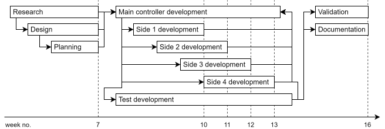

= Project Plan: {project}
include::share/meta.adoc[]

== Introduction

This document has been written by students following the computer science
curriculum at Avans University of Applied Sciences in Den Bosch. The purpose of
this document is to plan out the puzzle box project, in which realistic goals
will be established. Key points of this document include the way this project
is going to be developed, the expected outcome, and project management.
Throughout the semester project, this approach ensures process control and
provides a clear overview of activities and the work organization.

== Background information

This section gives the reader background information as to why the project is
necessary.

=== Project

During the introductory week, students participate in a competition task on
Monday afternoon. The goal is for teams to perform tasks related to electrical
engineering and computer science programs. The competitive element and
interaction with other groups are crucial. For the 19-20 introduction, the bomb
task was created, inspired by the game "Keep Talking and Nobody Explodes." A
description of the game can be found on the website cite:[Kee23].

Originally, the plan was to create a bomb that needs to be defused and a puzzle
box generating codes for defusing the bomb. A previous group successfully
developed a bomb requiring software and hardware creation by intro students,
followed by entering defusing codes. This system includes an RPI connecting to
the internet for bomb countdown time synchronization and remote control.
Additionally, a configuration program for PCs allows the bomb to be set to
countdown at a specific time. The bomb's hardware is ready, but a puzzle box
could still be created.

This puzzle box would generate codes to be entered on the bomb for defusing.
The bomb's software can be expanded for collaboration with puzzle boxes or
other additional features. Several puzzles for the puzzle box were developed in
the 20-21 academic year and improved upon in 21-22. A design for the box's
appearance has been created, along with software and a web-based user interface
for accessing a mesh network set up by the boxes.

== Project definition

This section describes the different aspect of the project, including the
analysis of the project, the approach to completing the project, and the goal
of the project.

=== Problem analysis

Currently, the idea of defusing a bomb has been realized and is being used in
the introductory weeks at Avans. However, a puzzle box has yet to be realized. 

Several puzzles were already developed in the 20-21 academic year and improved
upon in the 21-22 academic year. A design for the box's appearance has been
created, along with the software and web-based user interface for accessing a
mesh network which is set up by the boxes.

The puzzle box hardware and software need to transition from prototype status
to a final product, including the integration with the bombs. The hardware is
not complete for all puzzles, as these have been redesigned in the 22-23
academic year.

=== Project approach

During this project, kanban is used, in which different tasks are described
that are actually in constant motion. The advantage of this is that it is
actually always clear who is working on which task and which tasks still need
to be done. This does require each project member to keep track of their tasks
on the kanban board, to ensure efficiency and discipline while the project is
ongoing. The tools to enforce this are shown in <<sec:version-management>>.

=== Project goal

The purpose and motivation of this project is to create a puzzle box that
interacts with the existing bomb, which can be used in the introductory week. 

The bomb would have to be defused using codes given by the puzzle box. The
puzzle box would consist of several puzzles for the student to solve. These
puzzles are related to the Smart Hardware and Smart Software study paths.

The focus of this year's run of the puzzle box project (23-24) is to create a
new software framework from scratch, that allows future students working on
this project to easily integrate new puzzle modules, or port the existing
puzzles to different hardware. Previous iterations of this project were
realized with complicated libraries and/or frameworks, which requires extensive
research for students unfamiliar with them.

=== Halfway goal

Due to this project being divided over two periods a halfway goal has been
established. This goal must be reached in week seven of the project. The first
half of this project focuses on researching and designing the final product. As
a result, several documents are created. The documents delivered in this phase
of the project are the following:

-	Project Plan (this document)
-	Requirements document
-	Research document (1st version)
-	Design document (top-level software design)

=== Project outcome

The outcome of the project is that the puzzle box software has been brought to
a product-level. Furthermore, a software framework has been implemented, which
uses only software and programming languages native to the curriculum. A
temporary cli-interface has been realized, allowing for management of the game
state.

=== Project deliverables

- Project Plan
- Requirements Specification
- Design Specification
- Site acceptance test
- Factory acceptance test
- Qualification Document
- Puzzle box games/interface
- Handover plan

=== Product quality

Multiple tests will be created to safeguard the quality of the project. Code
and document reviews are also used to safeguard quality. More about this can be
found in <<sec:control-quality>>.

[[sec:phasing]]
== Project phases

[[sec:phase-research]]
=== Research phase

This project consists of several research topics which are stated below.

Investigating the already existing code/software that has been written by
previous project members to determine if the code/software could be
reused/ported to another controller or software language.

Another vital research topic to explore is the unit testing framework. By
investigating different unit testing frameworks, project teams can identify the
most suitable one for their specific needs, enabling them to maintain code
quality, detect bugs early, and facilitate smoother integration processes. That
means that for this project a new, robust, and future proof unit testing
framework needs to be chosen since there is none now.

Lastly, researching the controller, there is already a controller picked for a
prototype version of the puzzle box for this project, but it is unclear which
controller it is and if it is still a good option to continue using since the
puzzle box itself uses a Raspberry Pi, but the puzzle box consists out of
several puzzle modules which each must have their own controller. The raspberry
Pi for the box itself should be fine but for now it is unclear what is used for
the modules and what is the best option to move forward.

A design document will be set-up in where the decisions will be made based on
the conclusion of the research document for the following components:

- Puzzle modules (four sides)
- Main controller
- Communiction (with the bomb)
- Power supply

[[sec:phase-development]]
=== Development phase

The development phase is used to develop a product, or a predetermined part of
the product based on the research done in the previous phase and agreements
made with the customer.

This project and thus this phase will be executed using the well-known
KANBAN-method to not only bring more structure and an overview of the product
development but also to make sure that everything is according to the plan and
the customer is satisfied. This means that there will be regularly meetings
with the customer to verify that the requirements are met as expected by the
customer.

The development will be done using Visual Studio Code in combination with
several add-ons, if necessary, together with GitHub (GIT) for version
management. GitHub will also be used to manage project related tasks so that
all the tasks and issues can be tracked.

The software will be created according to the tasks planned in GitHub projects.
Each piece of software needs to be tested using a testing framework. 

The development will exist out of five main tasks which are:

- Main controller
- Side 1
- Side 2
- Side 3
- Side 4

The main controller's development will take up the most time thus will be
executed parallel to the development of the four sides. The development of the
sides will also mostly be parallel with just a small delay creating an overlap
between the sides.

[[sec:phase-qualification]]
=== Qualification

The last phase is the phase where everything needs to be tested and verified to
the agreed upon specifications. This will also be done using the KANBAN-method
as discussed in the previous chapter.

Testing of the code will be done using a unit testing framework to test
individual components, later manual testing is needed to test the complete
system which will be documented in a FAT. The customer will also be able to
test and verify the results during this phase to make sure that everything was
executed according to the plan.

Lastly, a document needs to be made with a recap of everything of this project,
from research, decisions that have been made to verify progress and a
conclusion with tips to continue this project so that the next project group
can continue this project.

Also all the other documents will need to be finalized and double checked,
especially the design document since it will function as a 'blueprint' of the
project.

== Project control

=== Risk management

What the possible risks are, and how they are managed, can be seen in the table
below.

.Risk management calculations
[cols="2,1"]
|===
| General risk calculation (Chance x Impact) | Outcome

| HxH | High
| HxA | High
| HxL | Average
| AxH | High
| AxA | Average
| AxL | Low
| LxH | Average
| LxA | Low
| LxL | Low
|===

[[sec:control-quality]]
=== Quality control

This project just as any other project need to meet a certain level of quality
and this quality needs to be controlled or better said verified/management.

The level of quality must be defined within each task so that it is easier to
verify, this also why tasks should be created as SMART tasks. After that the
quality can be verified by someone else on the project and/or the customer
using the definition within the task. 

The quality of the project itself should be defined within a separate so called
qualification document. A qualification document for a technical project serves
as a crucial piece of information that outlines the necessary qualifications
and criteria for individuals or teams involved in the project. 

This document typically includes details such as the required technical skills,
educational background, work experience, certifications, and any other specific
requirements needed to successfully contribute to the project. By clearly
defining the qualifications needed, this document helps ensure that the right
individuals are selected for the project, leading to its successful completion.

=== Project scope

The aim of this project is to create a puzzle box with 4 different puzzles
representing the different directions in this study. Examining the existing
hardware designs is an important task to get a good idea of their status. The
existing hardware designs from previous groups will be used as a reference to
develop the software on. The software will enable interaction between the user
and the puzzle box for solving the different puzzles.

So, the task in this project is to develop this software using the given
hardware designs. If certain parts of this hardware don’t work, this should be
described in the handover document so that the next hardware student can work
on it. 

It was decided to focus only on the puzzle box itself because this project
requires a lot of research to ground out the documents of the previous groups.
So, the loose bomb and web interface are left out of this project and can be
realised later.

In addition, contact will be kept with the customer to properly incorporate the
requirements into the final product and both parties will not face any
surprises.

== Parties & Roles

This section defines the entities involved in this project and describes their
role in the project.

=== Team members

<<tab:members>> lists the executive party involved in this project. These
people are responsible for implementation, documentation, testing and
communication with the stakeholders. 

[[tab:members]]
.Team member table
[cols="3*"]
|===
| Name | Role | Study path

| Thomas in ‘t Anker | Developer | Software
| Loek Le Blansch | Developer & Project lead | Software
| Lars Faase | Developer | Software
| Elwin Hammer | Developer | Software
|===

=== Communication

<<tab:stakeholders>> lists the stakeholders which receive regular updates
about the project. These people are informed about the current progress and
are involved in any meetings where requirements and/or specifications are
discussed.

[[tab:stakeholders]]
.Project communication table
[cols="2,1,2,1"]
|===
|Name|Role|Communication tool(s)|Frequency

|Jasper van den Heuvel|Client|School email; Teams|Weekly
|Jonathan Overes|Client|School email; Teams|Weekly
|===

[[sec:version-management]]
=== Version management

All source code developed during this project is kept under version control
using the Git cite:[gitscm] version control system and is available online at
GitHub cite:[gitrepo]. Each software component has a 3-digit version number
following semantic versioning cite:[semver] conventions (major, minor, patch).

This repository also utilizes Git submodules to track the versions of the
utilized libraries and SDKs. Submodules refer to commits, and can automatically
be initialized and managed using Git, so are not further specified in this
document.

All project documentation is realized using Microsoft Office products and is
therefore stored in a SharePoint folder cite:[sharepoint]. These documents use
a simple 2-digit (major, minor) version number system. The documents are
published at the discretion of the authors, with each new version incrementing
the minor version number. Major version number 0 is utilized for the document
draft versions, while 1 is utilized for documents after the project goal is
reached. A copy of all the documents is kept for each officially published
version.

== Planning

This project utilizes GitHub Projects cite:[githubprojects] to manage and
allocate tasks to team members. GitHub Projects supports multiple workflows,
but this project only follows the Kanban cite:[atlassiankanban] workflow. Since
the Kanban workflow does not require sprints, the project is divided into
milestones. A milestone is considered complete once all tasks assigned to it
are both marked as ‘complete’ and have been reviewed.

At the request of the stakeholders, time spent working on the project is
tracked by each team member using Clockify cite:[clockify].

[[fig:planning-condensed]]
.Condensed Gantt planning

<<fig:planning-condensed>> shows a Gantt-chart including the phases from
<<sec:phasing>>. The milestones are indicated with vertical dashed lines and
are marked with week numbers.

The research phase (<<sec:phase-research>>) includes the planning and writing
of the initial draft versions of all the project documents. The documentation
is also continuously updated during the development phase, but this is not
shown in <<fig:planning-condensed>>.

The development phase (<<sec:phase-development>>) consists of the continuous
development of the main (central) controller software and various accompanying
tests. During this phase, the software for each puzzle box side is developed in
parallel. Each side’s software development is staggered to avoid the
accumulation of tasks.

The qualification phase (<<sec:phase-qualification>>) consists of validating
the results of the development phase, fixing issues when they are discovered,
and finalizing all project documentation.

include::share/footer.adoc[]

