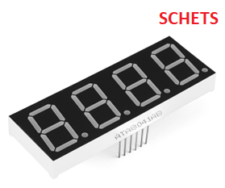
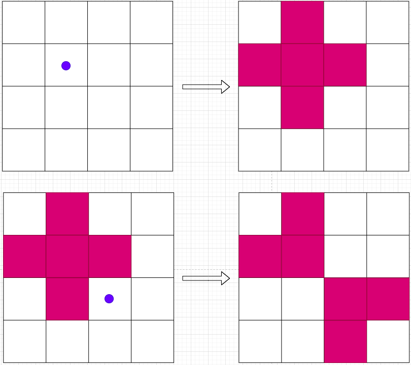
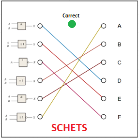

:document: Project Requirements
include::share/meta.adoc[]

== Introduction

In this document, the specifications are described prior to the investigation
of the Puzzle Box project. These specifications are partly derived from the
previously established requirements and are further supplemented and modified.
The priority of specifications is indicated using the MoSCoW method, see
<<tab:moscow>>.

[[tab:moscow]]
.MoSCoW Method cite:[Wik22]
[cols="20h,~"]
|===
| Priority | Description

| [[must,M]]<<must,Must have>>
| Represents essential system requirements. Without these, the system will not
function.
| [[should,S]]<<should,Should have>>
| Denotes desirable system features. The system can work without these, but it
lacks necessary elements.
| [[could,C]]<<could,Could have>>
| Refers to additional functionalities that can be implemented if there is
extra time.
| [[wont,W]]<<wont,Won't have>>
| Specifies requirements that will not be implemented in the current version
but may be considered in a future release.
|===

This specification document covers hardware, software, and game-specific
details. The focus in this project year for the Puzzle Box is to thoroughly
document the system and create a software framework for future groups.

== Context

This chapter describes how the user will interact with the system. This is done
in the form of a user story. This user story covers hardware, software, and
game specifications. From this narrative, many specifications can be derived
for both functional and non-functional requirements
(<<sec:functional>> and <<sec:technical>>).

The game administrator picks up the puzzle box and places it on a flat surface.
By using the key switch, the puzzle box is turned on, and the green indicator
LED lights up. Through the mesh network established by the external puzzle box
hub, the corresponding web panel can be accessed. The web panel provides
instructions for configuring the puzzle box, including linking it to any bomb.
The instructions issue a warning if any of the start conditions are not
properly set. If a criterion is incorrectly configured, it is highlighted for
resolution. Additionally, a warning is given if the battery capacity is
insufficient for one game duration, causing the indicator LED on the puzzle box
to turn red. In such cases, the battery should be charged using the USB-C
cable. While the puzzle box is charging, the indicator LED is blue. Once there
are no warnings and the puzzle box is adequately charged, the game can be
started in the web panel.

The puzzle box begins with the NeoTrellis game. In this game, players must turn
off all LEDs on an 8x8 button LED matrix. When any button is pressed, the
directly adjacent LEDs toggle. If a lit LED is toggled, it turns off; if an
unlit LED is toggled, it turns on. Once all LEDs are turned off, the game is
solved, and the software puzzle begins.

On the software puzzle, there are 6 banana plug connectors on both the left and
right sides. The ones on the left are labeled with various logical gates, while
the ones on the right are labeled from A to F. Participants in the bomb game
have 6 pieces of C-code written on paper, corresponding to the logical gates on
the puzzle box. The bomb participants must provide a description of the C-code
to the puzzle box participants, allowing them to correctly connect the
appropriate logical gate to the corresponding letter. Once the correct
combination of logical gates with the correct letter is made, the game is
solved. Subsequently, the automation puzzle is initiated.

Since there is no concept available for the automation puzzle yet, the hardware
puzzle is started directly.

The hardware puzzle is played in two distinct phases. In Phase 1, the objective
is to solve a combinatorial circuit such that its output becomes '1'. There are
8 inputs for this circuit, each controlled by an on/off switch. Once the
combinatorial circuit evaluates to '1', the LED at the output lights up,
indicating the completion of the first phase. In Phase 2, another LED blinks,
consistently repeating a pattern. This pattern represents a randomly generated
Morse code, corresponding to a number from 0 to 9999. Participants use a Morse
code table to decipher the correct number. Using four potentiometers, the
participants can set a number on a 7-segment display. When this number matches
the randomly generated one, the hardware puzzle is solved. Subsequently, the
vault puzzle is initiated.

In the vault puzzle, a 7-segment display shows a random combination of a letter
and a digit. Participants have access to a list containing the correct button
combination for the corresponding letter and digit. The vault puzzle consists
of 5 levels, each displaying a unique button combination from the list. When
participants correctly press the button on the keypad, the level advances, and
a new value is shown. Pressing the wrong button restarts the game at level 1.
Once all 5 levels are completed, the vault door unlocks, allowing access to the
inside of the puzzle box. On the mainboard, there is a 7-segment display
showing a code. This code must be relayed to the participants of the bomb game.
Once the bomb team receives the code, the puzzle box is considered solved.

[[sec:functional]]
== Functional Requirements

The functional requirements describe the things which are important to the
client. This is mainly about the way the product is going to be used, what it
is going to look like, and how the product reacts to interaction. This chapter
describes all functional requirements of the puzzle box.

=== The puzzle box

.Puzzle box specifications
[cols="8h,5h,~"]
|===
| ID | <<tab:moscow,Pri.>> | Specification

| <<req:1>> | <<must>> |
[[req:1,R-001]] The dimensions of the puzzle box are 30×30×30cm ± 5% (Length × Width × Height).

| <<req:2>> | <<must>> |
[[req:2,R-002]] The puzzle box extends a maximum of 5cm on the sides and the top.

| <<req:3>> | <<must>> |
[[req:3,R-003]] The puzzle box is flat at the bottom.

| <<req:4>> | <<must>> |
[[req:4,R-004]] The puzzle box has a key switch at the bottom of the NeoTrellis puzzle.

| <<req:5>> | <<must>> |
[[req:5,R-005]] The puzzle box has an indicator LED at the bottom of the NeoTrellis puzzle.

| <<req:6>> | <<must>> |
[[req:6,R-006]] The indicator LED turns green when the system is on and not charging.

| <<req:7>> | <<must>> |
[[req:7,R-007]] The indicator LED turns blue when the battery is charging.

| <<req:8>> | <<must>> |
[[req:8,R-008]] The indicator LED turns red when the battery does not have enough capacity for the duration of one game and is not charging.

| <<req:9>> | <<must>> |
[[req:9,R-009]] The puzzle box has a USB-C port at the bottom of the NeoTrellis puzzle for battery charging.

| <<req:10>> | <<must>> |
[[req:10,R-010]] The puzzle box has a distance sensor at the bottom to detect if it is lifted.

| <<req:11>> | <<must>> |
[[req:11,R-011]] The puzzle box main board (PCB on the bottom plate) includes a speaker.

| <<req:12>> | <<wont>> |
[[req:12,R-012]] When the puzzle box is lifted, the mainboard speaker emits an alarm sound for at least 10 seconds. It stops only when it has been on a table for another 10 seconds (detected by the distance sensor).

| <<req:13>> | <<wont>> |
[[req:13,R-013]] When the game is completed, the puzzle box produces a victory sound.

| <<req:14>> | <<wont>> |
[[req:14,R-014]] Pressing the "identify" button on the web panel causes the indicator LED to blink.

| <<req:15>> | <<wont>> |
[[req:15,R-015]] Pressing the "identify" button on the web panel triggers a sound from the speaker.

| <<req:16>> | <<wont>> |
// section 3.7 is inside the citation, and does not refer to section 3.7 in this document
[[req:16,R-016]] The game starts once the scheduler time is reached (refer to cite:[Bek23] section 3.7).
|===

=== The bomb

.Bomb specifications
[cols="8h,5h,~"]
|===
| ID | <<tab:moscow,Pri.>> | Specification

| <<req:17>> | <<must>> |
[[req:17,R-017]] The bomb includes a 6-digit 7-segment display for showing the remaining playtime.

| <<req:18>> | <<must>> |
[[req:18,R-018]] The bomb contains a keypad for entering the disarm code.

| <<req:19>> | <<wont>> |
[[req:19,R-019]] The 6-digit 7-segment display turns off when no game is in progress.

| <<req:20>> | <<wont>> |
[[req:20,R-020]] Once the disarm code is entered on the bomb keypad, the game is complete.

| <<req:21>> | <<wont>> |
[[req:21,R-021]] When the game is finished, the bomb emits a victory sound.

| <<req:22>> | <<wont>> |
[[req:22,R-022]] The timer on the bomb counts down from 60:00:00 to 00:00:00.

| <<req:23>> | <<wont>> |
[[req:23,R-023]] Pressing the "identify" button on the web panel causes the indicator LED to blink.

| <<req:24>> | <<wont>> |
[[req:24,R-024]] Pressing the "identify" button on the web panel triggers a sound from the speaker.

|===

=== The game

.General game specifications
[cols="8h,5h,~"]
|===
| ID | <<tab:moscow,Pri.>> | Specification

| <<req:25>> | <<wont>> |
[[req:25,R-025]] The game lasts for 1 hour.

| <<req:26>> | <<wont>> |
[[req:26,R-026]] The game should be solvable within the given playtime, without the player having prior knowledge of the game or its mechanics.

| <<req:27>> | <<must>> |
[[req:27,R-027]] The puzzles should be easy enough to solve without any prior knowledge of the game or its mechanics.

| <<req:edge-manual-reset>> | <<must>> |
[[req:edge-manual-reset,R-167]] A puzzle module can manually be reset at the discretion of the game operator

| <<req:edge-skip-puzzle>> | <<must>> |
[[req:edge-skip-puzzle,R-168]] A puzzle module can manually be set as solved at the discretion of the game operator

| <<req:28>> | <<wont>> |
[[req:28,R-028]] The disarm code for the bomb consists of 4 digits.

| <<req:29>> | <<wont>> |
[[req:29,R-029]] Once all games are solved, the mainboard PCB displays the disarm code on a red 7-segment 4-digit screen.

| <<req:30>> | <<wont>> |
[[req:30,R-030]] The puzzle box records the playtime of each game.

| <<req:31>> | <<wont>> |
[[req:31,R-031]] The puzzle box features 5 playable puzzles.

| <<req:32>> | <<wont>> |
[[req:32,R-032]] Only one game is active at a time; the other games do not respond to buttons.

| <<req:33>> | <<wont>> |
[[req:33,R-033]] The game always starts with the NeoTrellis puzzle.
|===

==== NeoTrellis puzzle

.NeoTrellis puzzle requirements
[cols="8h,5h,~"]
|===
| ID | <<tab:moscow,Pri.>> | Specification

| <<req:34>> | <<must>> |
[[req:34,R-034]] There is an 8x8 LED matrix where each LED can display different colors.

| <<req:35>> | <<wont>> |
[[req:35,R-035]] At the start of the puzzle, a pattern is displayed as shown in <<fig:neotrellis-start>>.

| <<req:36>> | <<wont>> |
[[req:36,R-036]] When a button is pressed, the adjacent LEDs and the pressed LED toggle (If an LED is off, it turns on. If an LED is on, it turns off).

| <<req:37>> | <<wont>> |
[[req:37,R-037]] All LEDs in the Neotrellis that are turned on are blue.

| <<req:38>> | <<wont>> |
[[req:38,R-038]] The puzzle is considered solved when all LEDs are turned off, and then the software puzzle starts.
|===

==== Software puzzle

.Software puzzle requirements
[cols="8h,5h,~"]
|===
| ID | <<tab:moscow,Pri.>> | Specification

| <<req:39>> | <<should>> |
[[req:39,R-039]] The software puzzle board has 6 banana plug connectors with different logic gates displayed next to them (Refer to <<fig:software-example-sketch>> for a sketch and <<fig:software-cable-sketch>> for a banana plug example).

| <<req:40>> | <<should>> |
[[req:40,R-040]] The software puzzle board has 6 banana plug connectors labeled with the letters A through F (Refer to <<fig:software-example-sketch>> for a sketch).

| <<req:41>> | <<should>> |
[[req:41,R-041]] At the start of the puzzle box game, the preparer must connect all cables in parallel (horizontally) to the connectors.

| <<req:42>> | <<wont>> |
[[req:42,R-042]] There are C code blocks visible only to the players on the bomb side, corresponding to the letters A through F (Refer to <<fig:software-codes-sketch>> for the codes).

| <<req:43>> | <<should>> |
[[req:43,R-043]] The combinations of logic gates to letters are always the same.

| <<req:44>> | <<wont>> |
[[req:44,R-044]] The puzzle is considered solved when the cables from the logic gates match the code blocks (Refer to <<fig:software-example-sketch>> and <<fig:software-codes-sketch>> for the combinations).

| <<req:45>> | <<wont>> |
[[req:45,R-045]] Once the puzzle is solved, the green indicator LED will light up (Refer to <<fig:software-example-sketch>> and <<fig:software-codes-sketch>>).

| <<req:46>> | <<wont>> |
[[req:46,R-046]] After the puzzle is solved, the automation puzzle begins.
|===

==== Automation puzzle

The specific details for this puzzle are not present in the previous
documentation. Due to time constraints, the section will be left empty.

.Automation puzzle requirements
[cols="8h,5h,~"]
|===
| ID | <<tab:moscow,Pri.>> | Specification

| <<req:47>> | <<wont>> |
[[req:47,R-047]] After the puzzle is solved, the hardware puzzle begins.
|===

==== Hardware puzzle

.Hardware puzzle requirements
[cols="8h,5h,~"]
|===
| ID | <<tab:moscow,Pri.>> | Specification

| <<req:48>> | <<should>> |
[[req:48,R-048]] There are eight switches on the hardware puzzle board.

| <<req:49>> | <<should>> |
[[req:49,R-049]] The hardware puzzle board features a diagram of a combinatorial circuit with 8 inputs (linked to the switches) and 1 output (Refer to <<fig:hardware-example-sketch>> for a sketch).

| <<req:50>> | <<should>> |
[[req:50,R-050]] The hardware puzzle board includes a red 7-segment 4-digit display (Refer to <<fig:hardware-example-sketch>> for a sketch).

| <<req:51>> | <<should>> |
[[req:51,R-051]] There are 4 potentiometers on the hardware puzzle board (Refer to <<fig:hardware-example-sketch>> for a sketch).

| <<req:52>> | <<should>> |
[[req:52,R-052]] A blue LED on the hardware puzzle board displays the morse code.

| <<req:53>> | <<should>> |
[[req:53,R-053]] A green LED on the hardware puzzle board indicates whether the combinatorial circuit is solved.

| <<req:54>> | <<wont>> |
[[req:54,R-054]] At the start of the puzzle, the potentiometers are inactive.

| <<req:55>> | <<wont>> |
[[req:55,R-055]] The 7-segment display is off at the beginning of the puzzle.

| <<req:56>> | <<wont>> |
[[req:56,R-056]] The LED for the combinatorial puzzle is off initially.

| <<req:57>> | <<wont>> |
[[req:57,R-057]] The morse code LED is off at the puzzle's outset.

| <<req:58>> | <<must>> |
[[req:58,R-058]] The preparer must set all switches to the down position at the start of the puzzle box game.

| <<req:59>> | <<must>> |
[[req:59,R-059]] The preparer must turn all potentiometers to the left (value '0') at the beginning of the puzzle box game.

| <<req:60>> | <<wont>> |
[[req:60,R-060]] The puzzle consists of two phases.

| <<req:61>> | <<wont>> |
[[req:61,R-061]] The puzzle begins in phase 1.

| <<req:62>> | <<wont>> |
[[req:62,R-062]] During the puzzle, the switches must be toggled to obtain a logical '1' at the output of the combinatorial circuit.

| <<req:63>> | <<wont>> |
[[req:63,R-063]] When the output of the combinatorial circuit equals '1', the green indicator LED turns on (Refer to <<fig:hardware-example-sketch>> for a sketch).

| <<req:64>> | <<wont>> |
[[req:64,R-064]] The puzzle proceeds to phase 2 when the output of the combinatorial circuit is a logical '1'.

| <<req:65>> | <<wont>> |
[[req:65,R-065]] The switches no longer respond once the puzzle enters phase 2.

| <<req:66>> | <<wont>> |
[[req:66,R-066]] The indicator LED from phase 1 remains green during phase 2.

| <<req:67>> | <<wont>> |
[[req:67,R-067]] In phase 2, a morse code is displayed using an LED. This morse code represents 4 numbers from 0 to 9 and repeats every second.

| <<req:68>> | <<wont>> |
[[req:68,R-068]] The morse code is randomly generated.

| <<req:69>> | <<wont>> |
[[req:69,R-069]] Each potentiometer can be rotated to display a value from 0 to 9 on the corresponding 4-digit 7-segment display. The order of the potentiometers matches the order of the segments on the display (Refer to <<fig:hardware-example-sketch>> for a sketch).

| <<req:70>> | <<wont>> |
[[req:70,R-070]] The puzzle is considered solved when the code displayed on the 7-segment 4-digit screen matches the 4 numbers from the morse code.

| <<req:71>> | <<wont>> |
[[req:71,R-071]] Once the puzzle is solved, the value shown on the 7-segment 4-digit display cannot be changed.

| <<req:72>> | <<wont>> |
[[req:72,R-072]] A 2-second victory sound is produced by the speaker upon solving the puzzle.

| <<req:73>> | <<wont>> |
[[req:73,R-073]] During the victory sound, the 7-segment display blinks twice per second.

| <<req:74>> | <<wont>> |
[[req:74,R-074]] After the victory sound, the puzzle has been solved and the vault puzzle begins.
|===

==== Vault puzzle

.Vault puzzle requirements
[cols="8h,5h,~"]
|===
| ID | <<tab:moscow,Pri.>> | Specification

| <<req:75>> | <<should>> |
[[req:75,R-075]] The vault puzzle board features a red 7-segment 4-digit display.

| <<req:76>> | <<should>> |
[[req:76,R-076]] On the vault puzzle board, there is a 4x4 grid of holes for ventilation and sound.

| <<req:77>> | <<should>> |
[[req:77,R-077]] The vault puzzle board includes a vault door, and the inside of the vault is transparent, allowing you to see inside the puzzle box.

| <<req:78>> | <<should>> |
[[req:78,R-078]] A sensor is integrated with the vault to detect when the vault is closed.

| <<req:79>> | <<must>> |
[[req:79,R-079]] At the beginning of the puzzle box game, the preparer must close the vault.

| <<req:80>> | <<wont>> |
[[req:80,R-080]] The puzzle starts at level 1.

| <<req:81>> | <<wont>> |
[[req:81,R-081]] Initially, the 7-segment display shows a code consisting of a letter and a digit. This code represents a valid key combination for level 1 (Refer to <<fig:vault-keypad>> for all combinations).

| <<req:82>> | <<wont>> |
[[req:82,R-082]] There are a total of 5 levels. After each level, a key combination is displayed, starting with a letter followed by a digit, which is valid for that level (Refer to <<fig:vault-keypad>>).

| <<req:83>> | <<wont>> |
[[req:83,R-083]] Each level has unique key combinations for the button locations (Refer to <<fig:vault-keypad>>).

| <<req:84>> | <<wont>> |
[[req:84,R-084]] Pressing the button corresponding to the letter-digit combinations advances the puzzle to the next level.

| <<req:85>> | <<wont>> |
[[req:85,R-085]] If an incorrect button is pressed, the game resets to level 1.

| <<req:86>> | <<wont>> |
[[req:86,R-086]] An error sound is produced by the speaker when an incorrect button is pressed.

| <<req:87>> | <<wont>> |
[[req:87,R-087]] The 7-segment display blinks when an incorrect button is pressed.

| <<req:88>> | <<wont>> |
[[req:88,R-088]] After completing 5 levels, the puzzle is solved, and the vault opens.
|===

=== Battery

.Battery requirements
[cols="8h,5h,~"]
|===
| ID | <<tab:moscow,Pri.>> | Specification

| <<req:pwr-battery>> | <<must>> |
[[req:pwr-battery,R-089]] The puzzle box is powered by a rechargeable battery.

| <<req:90>> | <<must>> |
[[req:90,R-090]] The battery lasts for a minimum of 4 hours.

| <<req:91>> | <<could>> |
[[req:91,R-091]] The battery in the puzzle box can be replaced.
|===

=== Network Communication

.Communication requirements
[cols="8h,5h,~"]
|===
| ID | <<tab:moscow,Pri.>> | Specification

| <<req:92>> | <<wont>> |
[[req:92,R-092]] The puzzle boxes, bombs, and the puzzle box hub must all be able to communicate with each other.

| <<req:93>> | <<must>> |
[[req:93,R-093]] Communication between two devices in the network must have a range of at least 20 meters in an open field.
|===

=== Framework

[cols="8h,5h,~"]
|===
| ID | <<tab:moscow,Pri.>> | Specification

| <<req:main-static>> | <<must>> |
[[req:main-static,R-130]] The main controller and its software do not need to be modified to implement a new puzzle module

| <<req:131>> | <<could>> |
[[req:131,R-131]] Puzzle modules can be added and removed while the main controller is powered on

| <<req:pm-swap>> | <<must>> |
[[req:pm-swap,R-132]] Puzzle modules can be added and removed while the main controller is powered off

| <<req:main-interface>> | <<must>> |
[[req:main-interface,R-133]] The puzzle box provides a single external interface for accessing and controlling game state variables
|===

=== Puzzle box hub

.Puzzle box hub general requirements
[cols="8h,5h,~"]
|===
| ID | <<tab:moscow,Pri.>> | Specification

| <<req:94>> | <<wont>> |
[[req:94,R-094]] The puzzle box hub hosts a website that can be accessed by a device connected to the network.
|===

[[sec:technical]]
== Technical Requirements

The technical specifications describe the specifications that are important for
developers. For example, this could include specific requirements related to
current, voltage, or communication protocols. This chapter outlines all the
technical specifications of the puzzle box.

=== Wireless communication

.Wireless communication requirements
[cols="8h,5h,~"]
|===
| ID | <<tab:moscow,Pri.>> | Specification

| <<req:127>> | <<must>> |
[[req:127,R-127]] The wireless communication between the system controller, bomb, and puzzle box operates over a WiFi mesh or WiFi network.
|===

=== Framework

.Development framework requirements
[cols="8h,5h,~"]
|===
| ID | <<tab:moscow,Pri.>> | Specification

| <<req:128>> | <<must>> |
[[req:128,R-128]] A framework has been created to assist future groups in the development of the puzzle box.

| <<req:129>> | <<must>> |
[[req:129,R-129]] The framework runs on the main puzzle box controller.

| <<req:134>> | <<must>> |
[[req:134,R-134]] Puzzle modules are detected by the main controller module.

| <<req:135>> | <<must>> |
[[req:135,R-135]] Puzzle modules are initialized by the main controller module.

| <<req:165>> | <<must>> |
[[req:165,R-165]] Puzzle modules repeatedly send 'update' messages to the main controller while their global state is 'uninitialized'
|===

=== Main controller

.Main controller requirements
[cols="8h,5h,~"]
|===
| ID | <<tab:moscow,Pri.>> | Specification

| <<req:main-i2c-ctrl>> | <<must>> |
[[req:main-i2c-ctrl,R-136]] The main controller has at least 1 I2C peripheral.

| <<req:main-802-11-ap>> | <<must>> |
[[req:main-802-11-ap,R-137]] The main controller can connect to a standard 802.11b/g/n access point.

| <<req:main-tcp-socket>> | <<must>> |
[[req:main-tcp-socket,R-138]] The main controller can serve TCP socket connection(s).

| <<req:main-devkit-supplier>> | <<must>> |
[[req:main-devkit-supplier,R-139]] The main controller is available as a development kit from Farnell.

| <<req:140>> | <<should>> |
[[req:140,R-140]] The main controller can communicate over I²C with a speed of 400kb/s

| <<req:main-pwr-efficient>> | <<should>> |
[[req:main-pwr-efficient,R-166]] The main controller is power efficient.
|===

=== Puzzle module controller

[cols="8h,5h,~"]
|===
| ID | <<tab:moscow,Pri.>> | Specification

| <<req:pm-i2c-ctrl>> | <<must>> |
[[req:pm-i2c-ctrl,R-141]] The puzzle module controller has at least 1 I2C peripheral.

| <<req:pm-gpio>> | <<should>> |
[[req:pm-gpio,R-142]] The puzzle module controller has enough I/O ports to control a puzzle.

| <<req:pm-pwr-efficient>> | <<should>> |
[[req:pm-pwr-efficient,R-143]] The puzzle module is power efficient.

| <<req:pm-clk-ctrl>> | <<must>> |
[[req:pm-clk-ctrl,R-144]] The puzzle module has a configurable clock speed.

| <<req:pm-devkit-supplier>> | <<must>> |
[[req:pm-devkit-supplier,R-145]] The puzzle module controller is available as a development kit from Farnell.

| <<req:146>> | <<should>> |
[[req:146,R-146]] The puzzle module can communicate over I²C with a speed of 400kb/s
|===

=== Vault puzzle

.Vault puzzle requirements
[cols="8h,5h,~"]
|===
| ID | <<tab:moscow,Pri.>> | Specification

| <<req:147>> | <<must>> |
[[req:147,R-147]] The vault puzzle can communicate with the main controller using I²C

| <<req:148>> | <<wont>> |
[[req:148,R-148]] The vault puzzle can produce a sound signal for the buzzer

| <<req:149>> | <<must>> |
[[req:149,R-149]] The vault puzzle can lock & unlock a solenoid lock

| <<req:150>> | <<must>> |
[[req:150,R-150]] The vault puzzle can translate and obtain a button press from the 3x4 keypad using 5 inputs

| <<req:151>> | <<must>> |
[[req:151,R-151]] The vault puzzle can communicate with a 4x 7 SEG. Display using 2 lines (clock & data)

| <<req:152>> | <<should>> |
[[req:152,R-152]] The vault puzzle can read a sensor's value to detect if the vault door is open or closed.
|===

=== Bomb

.Bomb requirements
[cols="8h,5h,~"]
|===
| ID | <<tab:moscow,Pri.>> | Specification

| <<req:153>> | <<wont>> |
[[req:153,R-153]] The bomb can communicate with the hub using a TCP socket connection

| <<req:154>> | <<must>> |
[[req:154,R-154]] The bomb can sync. time using the WiFi connection

| <<req:155>> | <<wont>> |
[[req:155,R-155]] The bomb can retrieve, and store a given code in order to verify it later on input

| <<req:156>> | <<should>> |
[[req:156,R-156]] The bomb can be paired to a puzzlebox using the hub's interface
|===

== Preconditions

This section describes the aspects of the project which have been set as
preconditions and cannot be changed.

.Preconditions
[cols="8h,~"]
|===
| ID | Precondition

| <<req:160>> | [[req:160,R-160]] The delivery of components cannot take longer than two weeks.
| <<req:161>> | [[req:161,R-161]] The price of a single puzzle box is not higher than €150.
| <<req:162>> | [[req:162,R-162]] The existing games are used in the puzzle box.
| <<req:163>> | [[req:163,R-163]] The puzzle box is not allowed to make a connection with the Avans network (Eduroam).
| <<req:164>> | [[req:164,R-164]] The bomb hardware cannot be changed.
|===

== Documentation

This section lists requirements that apply to documentation produced during
this project.

[cols="8h,5h,~"]
|===
| ID | <<tab:moscow,Pri.>> | Specification

| <<req:157>> | <<should>> |
[[req:157,R-157]] All documentation is written according to the style guide cite:[styleguide]

| <<req:158>> | <<should>> |
[[req:158,R-158]] All documentation is manually checked for spelling and grammar mistakes before being published

| <<req:159>> | <<must>> |
[[req:159,R-159]] All project documents are examined once by Jonathan Overes from Avans
|===

[appendix]
== Attachments

[[fig:vault-disp-sketch]]
.7 Segment 4 digit screen (sketch)

[[fig:neotrellis-hardware-sketch]]
.NeoTrellis example (sketch)

[[fig:neotrellis-toggle]]
.Toggling LEDs after the user pressed on the button (purple dot)

[[fig:neotrellis-start]]
.Starting pattern of the NeoTrellis puzzle
image::img/neotrellis-start.png[width=45%]

[[fig:software-example-sketch]]
.Software puzzle example with logical ports (left) and letters A through F (right)

[[fig:software-codes-sketch]]
.The different code fragments corresponding with the letter A through F
image::img/software-codes-sketch.png[height=35%]

[[fig:software-cable-sketch]]
.Software puzzle cable example
image::img/software-cable-sketch.png[]

[[fig:hardware-example-sketch]]
.Hardware puzzle on the puzzle box
image::img/hardware-example-sketch.png[]

[[fig:vault-keypad]]
.Buttons combinations with level numbers in the top left
image::img/vault-keypad.png[width=45%]

include::share/footer.adoc[]

