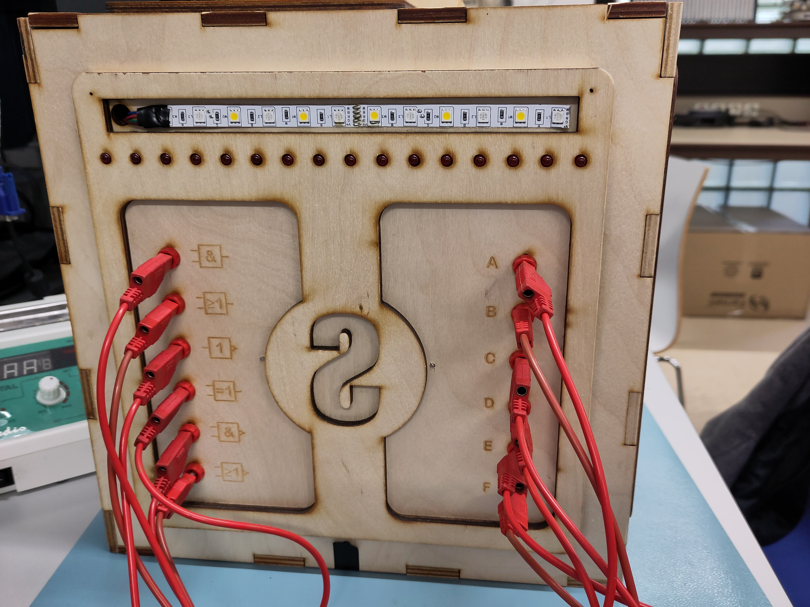
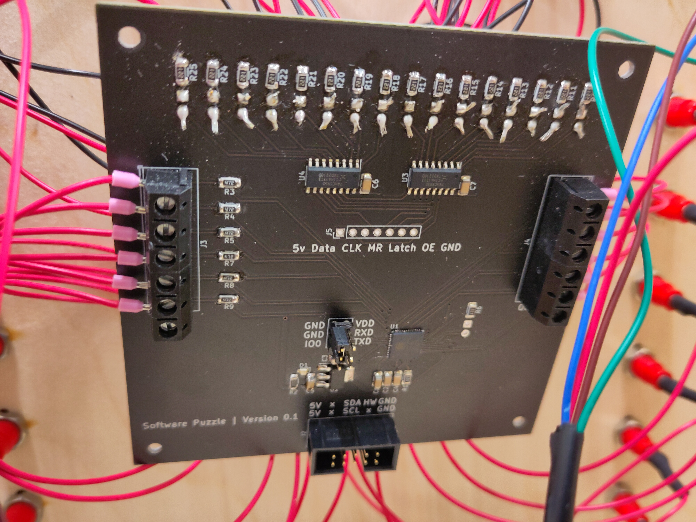

:document: Research
include::share/meta.adoc[]

== Microcontrollers used in the current state (Elwin)

=== Research

// TOOD: figures 1 through 4 waren geen cross-references meer in het originele
// document, en moeten nog opgelosd worden
The boxes consist of four sides in use (games) which can be seen in the
Attachments figures 1 through 4. One of the games (safe puzzle) seems to be
unfinished upon visual inspection which also includes a lose display. The games
that seem to be implement are the following:

* Safe puzzle: <<fig:vault-side>>
* Neotrellis puzzle: <<fig:neotrellis-side>>
* Software puzzle: <<fig:software-side>>
* Hardware puzzle: <<fig:hardware-side>>

The bus cable (<<fig:bus-connector>>) consists out of five connectors with ten
lines, the main controller (as already known) is a Raspberry Pi 3B+ with an 8GB
MicroSD card and a custom PCB 'head' see <<fig:main-pcb>>. There are 4 custom
PCB's with a microcontroller slot and a connector for the 10-line bus, two of
those are used for the sides and one is unused and also empty see
<<fig:unknown-pcb>>. Of all the custom PCB's only one seems to be professional
made from a factory see <<fig:hardware-pcb>>, the others seem to be made at
school in the lab. 

* Safe puzzle PCB: <<fig:vault-pcb>>
* Software puzzle PCB: <<fig:software-pcb>>

There is also one development board from Adafruit see <<fig:neotrellis-pcb>>
but this one does not seem to be connected to any bus. The underside of the box
has a large light sensitive sensor which is also not connected see
<<fig:light-sensor>>.

The more professional custom-made PCB has an ESP32-PICO-D4 as microcontroller
see <<fig:hardware-pcb>>. The other custom-made PCB's do not have any
microcontroller installed but seem to be made to be used by a ESP32-PICO-KIT
V4/V4.1.

=== Summary

There seems to be four games implemented where of only one may work because of
its integrated ESP32, the other three also may work if the missing ESP32's are
included but it is unclear if the 'unknown' PCB should be used in combination
with the Neotrellis panel and what need to be done with the safe side to get it
to work.

=== Conclusion

It could be quite possible that the 'unknown' PCB should be connected to the
Neotrellis panel based on the data lines properties. But besides that, only the
software may need to be updated in order to run on the ESP32's as soon as the
'missing' ESP32 dev kits are in stock. 

But everything could be made less complex, more cost effective and power
efficient by using other type of microcontrollers. The RPI could be downgraded
to a RPI Zero or an ESP32 dev kit. The microcontrollers used for the sides
could be replaced by a much smaller chip like the ATTiny or a Atmega32.

This can only be done if the following requirements are met:

* Dev. Board or daughterboard with spring or screw terminals
* A microcontroller with enough IO
* A microcontroller with all the required communication busses.
* It may not cost more than one day to rebuild the system.

A follow up research should reveal which microcontroller and dev. Board /
daughterboard is best fitted for this project.

=== NOTES

The Dev kits are not available and newer types do not meet the current
footprint of the custom PCB's. So it is suggested that the next group will
design a pcb with another MCU on it in order to match the pin layout and make
use of a smaller more efficient chip. Or they can convert the prototype PCB's
to a production version with the ESP32 chip on it (if the chip it self it still
available at that time) or pick another MCU in that stage anyway.

The hardware side uses a single DSP (HC166) to process the input of the
switches, the software side uses two shift registers (74HC59SD) to control the
LED's.

Issues

. Button row 4, col 1 for the safe side needs to be replaced (missing a pin)
. LED strips for the software and hardware sides only work for 50%.

==== Appendix (Loek)

The puzzle bus connector (see <<fig:bus-connector>>) appears to have 10
conductors in total. The hardware schematics from 21-22 reveal the pinout of
this bus connector, which is shown in <<fig:puzzle-bus-connector>>.

After searching through the other design documents from this year, no
references to the "HarwareInterrput" line or interrupts in general were found.
The puzzle source code folders also did not contain code which initialized this
line as an interrupt. It is assumed this line is unusable, as it is connected
but has no specified functionality.

// this is super verbose but works
:fig-caption: {figure-caption} {counter:figure-number}
[[fig:puzzle-bus-connector,{fig-caption}]]
.Puzzle bus pinout
[caption="{fig-caption}. "]
====

[.text-center]
Source: cite:[2122_design] +
(Connector key is next to pin 5)
====

== Controllers (Loek)

To mitigate power consumption issues discovered by the 21-22 group, new
controllers were chosen for this year's (23-24) run of the puzzle box project.
This section compares different microcontroller options for both the main
controller and controller used in puzzle modules. 

=== Main controller

The following criteria were used to compare MCUs that are suitable candidates
as main controller unit:

* Must have at least 1 I^2^C peripheral (<<reqs.adoc#req:main-i2c-ctrl>>).
* Must be able to connect to a standard 802.11b/g/n access point
  (<<reqs.adoc#req:main-802-11-ap>>).
* Must be able to serve TCP socket connection(s)
  (<<reqs.adoc#req:main-tcp-socket>>).
* Should be power efficient (<<reqs.adoc#req:main-pwr-efficient>>).
* Is available as a development kit from Farnell
  (<<reqs.adoc#req:main-devkit-supplier>>).

<<tab:main-mcu>> lists the considered MCU options matching the above criteria.
This list is a compilation of microcontroller offerings from the following
manufacturers: Atmel, Espressif, Raspberry Pi.

Of these controllers, the Raspberry Pi RP2040 has the lowest clock speed and
highest memory. Its lower clock speed means that it will likely draw less power
than the other options. It also happens to be less expensive than all other
options. Due to these reasons, the RP2040 was chosen as main controller MCU.
The Raspberry Pi Pico W board is utilized during development.

[[tab:main-mcu]]
.Main controller MCU candidates
[%autowidth]
|===
| Model | I^2^C peripheral count | SRAM | Flash | Clock speed

| WFI32E01PC | 1 | 256 KB | 1 MB | 200 MHz
| ESP8266 | 1 | 50 KB | 16 MB | 160 MHz
| RP2040 | 2 | 264 KB | 2 MB | 133 MHz{empty}footnote:[Adjusting the clock speed for the main controller is not necessary, even though the RP2040 supports clock speed configuration (see <<tab:pm-mcu>>)]
|===

=== Puzzle module controller

The following criteria were used to compare MCUs that are suitable candidates
for controlling the puzzle modules:

* Must have at least 1 I^2^C peripheral (<<reqs.adoc#req:pm-i2c-ctrl>>).
* Should has enough I/O ports to directly control moderately complex puzzles
  (<<reqs.adoc#req:pm-gpio>>).
* Should be power efficient (<<reqs.adoc#req:pm-pwr-efficient>>).
* Is available as a development kit from Farnell
  (<<reqs.adoc#req:pm-devkit-supplier>>).
* Has a configurable clock speed (<<reqs.adoc#req:pm-clk-ctrl>>).

<<tab:pm-mcu>> lists the considered MCU options matching the above criteria.
This list is a compilation of microcontroller offerings from the following
manufacturers: Atmel, STMicroelectronics, Raspberry Pi.

All the MCUs listed in <<tab:pm-mcu>> support some version of a low-power mode.
The RP2040 is again included and appears here because it supports clock speed
configuration and has a clock gate for each peripheral [2], which may make it a
feasible option with regards to power consumption. Choosing the RP2040 may also
simplify the development process as only a single MCU toolchain needs to be
maintained.

The Microchip PIC16F15276 is the most power efficient on this list and is the
recommended MCU for puzzle modules. It supports both extreme underclocking and
has a low power mode. This chip is available as the 'MICROCHIP EV35F40A'
evaluation kit.

Because this year's run of this project was carried out by a team consisting
only of software students, this choice remains as a recommendation. The puzzle
box hardware may still use the ESP32 development kits from the 21-22 group.

[[tab:pm-mcu]]
.Puzzle module controller MCU candidates
[%autowidth]
|===
| Model | I/O ports | I^2^C peripheral count | SRAM | Flash | Clock speed

| PIC16F15276 | 40 | 1 | 2 KB | 28 KB | 32 kHz – 32 MHz
| STM8L152C6T6 | 41 | 1 | 2 KB | 32 KB | 38 kHz – 16 MHz
| RP2040 | 26 | 2 | 264 KB | 2 MB | 10 MHz – 133 MHz
|===

=== Conclusions

The main MCU that is utilized for this year's (23-24) run of this project is
the Raspberry Pi RP2040 on the Raspberry Pi Pico W. The recommended MCU for new
puzzle modules is the Microchip PIC16F15276. The existing puzzle modules still
utilize the ESP32 development kits chosen by the 21-22 group.

== Main Controller OS (Loek)

Because the hardware produced by the 21-22 group uses a Raspberry Pi 3B+ as
main controller, the usage of this specific board was turned into a
prerequisite for this project (??). The Raspberry Pi 3B+ uses the Broadcom
BCM2837 chipset, which supports the aarch64 instruction set cite:[rpicpu].
Because the puzzle box should be able to run on battery power (??), the CPU
should be under as little load as possible to preserve power. Choosing the
right operating system is crucial to ensure maximum control over which
processes consume CPU resources. This section indexes the available operating
systems that support the aarch64 instruction set to support the decision for
main controller OS in the design document [??].

Each operating system is evaluated on the following criteria:

* Number of 'base' software packages (pre-installed software)
* Size of base installation (base disk utilization)
* Time required to get set-up
* Software iteration time (amount of work required to complete a
  compile-upload-run cycle)
* Whether it is covered by the standard curriculum at Avans University of
  Applied Sciences

All of these factors (except for curriculum coverage) should be low. This means
that operating systems that are minimalistic by default are preferred.

=== Raspberry Pi OS Lite (Debian)

The manufacturer of the Raspberry Pi boards publishes a modified version of the
Debian Linux distribution which is aimed at general-purpose users [??]. It
comes with an easy-to-use installer, and is the only OS officially supported by
the manufacturer of this board. All the required drivers come pre-installed,
which means this OS has very little setup time.

Raspberry Pi OS comes in 3 different varieties [??], the 'Light' variant of
which is the most minimalistic. This variant comes with the least number of
pre-installed software packages and has a base image size of 2.6 GiB after
extracting the archive from the official download page [??].

This exact OS is not covered in the normal curriculum, but other derivative
distributions of Debian are, so this OS is be considered familiar.

=== Void Linux

=== Linux From Scratch

=== Bare-metal Firmware

=== Conclusions

<<tab:main-os>> summarizes the considered operating systems based on the
criteria outlined at the start of this section.

[[tab:main-os]]
.Main controller OS comparison
[%autowidth]
|===
| | Packages | Size | Set-up time | Iteration time | Covered

| Raspberry Pi OS Lite | 592 | 2.6 GiB | Medium | Short | Yes
| Void Linux | 126 | 334 MiB | Short | Short | No
| Linux from scratch | n/a | 25+ MiB | Long | Long | Yes
| Bare-metal firmware | n/a | n/a | Long | Long | No
|===

== Unit Testing Framework Research (Thomas)

=== Research question

Which unit testing frameworks are available and relevant to the project,
keeping in mind RTOS-specific frameworks, and what features do they have?

=== General framework comparison

In <<tab:test-framework>> is a general comparison shown of multiple different
frameworks. These are either a header-only testing framework, a testing
framework specifically designed for embedded systems, a general-purpose {cpp}
library, or a specialized {cpp} unit testing framework. The following
subsections will give more information about each framework and their features.

[[tab:test-framework]]
.General testing framework comparison cite:[Ali24,Joh21]
[%autowidth]
|===
| Framework | Language | Lightweight | Mocking Support | Portable

| CppUTest | C/{cpp} | Yes | Yes (CppUMock) | Yes
| Catch | {cpp} | Yes | Limited | Yes
| Doctest | {cpp} | Yes | Limited | Yes
| Google Test | {cpp} | No | Yes (GMock) | Yes
| Boost.Test | C | Yes | Limited | Yes
|===

=== CppUTest

A C/{cpp} based unit testing framework, designed specifically for testing C/{cpp}
applications on embedded systems. It can be used for testing general C/{cpp} code
and supports TDD-style tests (Test-Driven Development). This is due to it being
a header-only testing framework, and not requiring linking of external
libraries.

It offers multiple different assertion macros for verifying expected behavior
and supports the mocking of functions and memory leak detection. It works on
most platforms, including Unix-based systems, Cygwin, and MacOS. It can be
integrated with build systems like Make or CMake. The framework is also
compatible with RTOS-based applications and Raspberry Pi, both require
configuring the development environment to allow CppUTest to work. It supports
up to the {cpp}17 standard, after which there is experimental support for the
{cpp}20 & {cpp}23 standards. cite:[Cpp24]

=== Catch

A {cpp} unit testing framework designed in a straightforward and expressive
manner. Just like CppUTest it is a header-only testing framework and doesn't
have any external dependencies, but instead of supporting TDD-style testing, it
supports BDD-style testing. Which is Behavior-Driven Development-style testing,
where test cases can be written in a natural language format (Given-When-Then
statements).

It offers a simplified testing syntax, and assertions look like {cpp} Boolean
expressions. It allows the developer to organize tests into sections, providing
a local (in file) way to share setup and teardown code. It also allows
developers to tag tests and run tests selectively using their tags. The
framework is also compatible with RTOS-based applications and can be used on a
Raspberry Pi. It supports up to the {cpp}20 standard, after which there is
experimental support for the {cpp}23 standard. cite:[Cat24]

=== Doctest

A {cpp} based unit testing framework, designed to be minimalistic, easy to
integrate and expressive. It supports {cpp}11/14/17/20/23 and allows for writing
tests directly in production code, due to it being a single-header library.

The tests written with this framework are automatically discovered and executed
without any manual registration. It has no separate compilation steps for the
tests as it is header-only and is thread-safe by default. It also allows for
customizable test output formats and is compatible with RTOS/Raspberry Pi.
cite:[Doc24]

=== Google Test

A {cpp} based testing framework, following the xUnit architecture, which is used
for structuring tests. It is a single-header library just like doctest;
however, it does require the developer to write tests in separate test files.
It has minimal external dependencies allowing it to easily integrate into
projects. 

It supports mocking functions and has a large variety of assertions for
verifying expected behavior, including death tests. It allows the developer to
run tests multiple times with different input values and the developer can set
up common test environments using fixtures. Furthermore, it allows for custom
assertions and test output. It is also thread-safe by default. It supports
testing for RTOS/Raspberry Pi, as well as {cpp}20 and lower. There is
experimental support for {cpp}23. cite:[goo24]

=== Boost.Test

A {cpp} based unit testing framework, designed for writing, and organizing unit
tests. It is compatible with {cpp}11/14/17 and can be integrated with {cpp}
projects running on RTOS platforms. However, even though you can use Boost.Test
on the Raspberry Pi, it does not have direct Raspberry Pi-specific features.

It supports the creation of test suites, allowing the developer to group test
cases into logical suites. Furthermore, it provides a wide range of assertion
macros for checking test conditions and can generate test result reports in
various formats (e.g. XML, human-readable). It works on most platforms,
including Windows, Linux, macOS, and other Unix systems. cite:[Boo24,Git24]

=== Conclusion

After going through the researched unit tests a few things can be noted for
each framework. CppUTest has been designed for embedded system testing and has
features for memory leak detection and mocking. However, it is supported until
{cpp}17 while the other versions for {cpp} are all experimental. Catch allows for
easy test creation. Furthermore, it allows for test tagging meaning you are
able to run tests selectively using their tags and it is supported up to {cpp}20.
Doctest allows for writing tests directly in production code, meaning a second
test file is not necessary. It has an automatic test discovery function, as
well as being thread safe on default and allowing customizable test output
formats. Google Test uses xUnit test architecture and supports mocking
functions. It has a large variety of assertions including death assertions and
supports running tests multiple times with different input values. It allows
custom test assertions / test output and is thread-safe by default. It also has
support up to {cpp}20. Boost.Test allows for writing and organizing unit tests
and has support for {cpp}11/14/17. It supports the creation of test suites,
making test grouping possible. It has a large range of assertion macros and can
generate test result reports in multiple different formats.

After going through the notable features of the different testing frameworks
Google Test was chosen as the testing framework for this project. As it has a
structured syntax, readability and a lot of features required for reliable
testing. Including mocking tests, a large amount of assertions, multiple test
with different input support, and lastly being supported in the newest
non-experimental version of {cpp}. 

== Original Puzzle Box Functionality Research (Thomas)

=== Research question

What gameplay functionality should the original puzzle box have had?

=== Group 2019-2020

==== Hardware Puzzle

The hardware puzzle was to be a puzzle consisting of two parts, a puzzle using
a 555-oscillator and a puzzle using a multi meter. The 555-oscillator puzzle
would be used to give students an idea how they can create a typical hardware
application. The multi meter puzzle would introduce students to the usage of
the multi meter, while giving the bomb group the values measured using the
multimeter which then correlates with 3 different potentiometers.

==== Software Puzzle

The software puzzle was to be a puzzle which introduces the student to an
Arduino. The puzzle box would contain an Arduino, a few switches, and a few
LEDs. The student would be able to program the Arduino by using a visual
drag-and-drop programming language. This program would have to get an input
value, which is given by the switches, and an output value shown on the LEDs.
The idea is to get both the input and output value correspond with each other.

==== Automation Puzzle

The automation puzzle would introduce the student to a factory structure,
consisting of multiple 'tubes' which contain a certain color. These colors
could be mixed by the students to get the corresponding colors shown in their
game manual. The tubes which contain these colors would have to follow a
specific route, and are to join with other tubes, creating new colors which
makes the puzzle a bit more complex. The valves to open and close the tubes are
grouped to add another difficulty level to the puzzle. See
<<fig:automation-example>> for an example of this puzzle.

==== Safe Puzzle

The safe puzzle is a puzzle created to test the communication skills of the
student. It shows a code on the puzzle box, which then needs to be given to
students with the game manual, who give the students at the puzzle box the
button they must click. This needs to be done 5 times before the safe opens and
the last code is given to defuse the bomb if a wrong button is clicked the safe
resets and they need to start over from the beginning. See
<<fig:vault-interface>> & <<fig:vault-keypad-full>>.

=== Group 2020-2021

The automation and safe puzzle were not changed this year.

==== Hardware Puzzle

The hardware puzzle was revised this year, it would include a quiz which helps
the students with solving the puzzle and has a completely different interface
from the first one. The quiz questions can be found in the document
"Speluitleg_puzzlebox_39-06-2021", which can be found in this project's
directory. Once the students solve the quiz, they can push the button found in
the puzzle, and morse code will be given to the students. The code given using
morse code is one of the required codes to disarm the bomb.

==== Software Puzzle

The software puzzle was also revised this year, instead of a puzzle using a
visual drag-and-drop programming language it would instead contain two columns
which would need to relate to each other. One column shows digital ports, which
is part of 'Digitale Techniek' and the second column contains letters
corresponding with C code. This code can be found in the game manual and
requires the students to communicate between each other which letter which code
is. Once all cables are connected the LEDs above the puzzle will glow in
binary, this needs to be deciphered into decimals to get another code to defuse
the bomb. An example of this puzzle can be seen in <<fig:software-example>> &
<<fig:software-codes>>.

==== Neotrellis Puzzle

A new puzzle was added to the box, namely a neotrellis-type puzzle. This would
mainly be a puzzle requiring a lot of figuring out, as it does not correlate
with any of the three directions in the Technical Computer Science curriculum.
It would contain an 8x8 LED button system, where you can toggle the LEDs by
clicking on a button. You complete the puzzle by getting a matching pattern
with the one given in the game manual. See <<fig:neotrellis-toggle>>,
<<fig:neotrellis-example>> & <<fig:neotrellis-start>> for examples of this
puzzle.

=== Group 2021-2022

The software, automation, safe, and neotrellis puzzles were not changed this
year.

==== Hardware Puzzle

The hardware puzzle was revised again this year, removing the quiz, and making
it a data flow puzzle using logic gates and circuitry. There wasn't any more
information about the way to solve the puzzle. See <<fig:hardware-side>> for an
example of this puzzle on the puzzle box.

=== Group 2022-2023

No puzzles were changed this year.

=== Conclusion

The puzzles have gone through a lot of changes and designs, but in the end the
following puzzles will be used from project group 2019-2020:

* Automation puzzle
* Safe puzzle

The following puzzles will be used from project group 2020-2021:

* Software puzzle
* Neotrellis puzzle

And the following puzzle will be used from project group 2021-2022:

* Hardware puzzle

The way these puzzles are solved has been summarized in this research document,
but the most complete versions of how to solve these puzzles are given in the
group's respective design document.

== Research of hardware designs of previous groups (21-22 and 22-23) (Lars)

This part of the research looks at the hardware designs of the previous groups
that did this project. These are compared with each other and finally the
points of interest are given that the software must meet in order to work with
this hardware.

=== Design of 21-22 group

This group has developed a puzzle box with a puzzle on all sides. Each puzzle
has to answer a question from the different directions in this study. So, think
software, hardware and an automation puzzle. The 21-22 group designed and
started the realisation of a physical puzzle box. The status of the puzzle box
is a carved wooden box containing one mainboard hat for the Raspberry PI 3B+
(chosen for its availability), one puzzle based on the ESP32-PICO-D4 system on
chip (SOC) and three puzzle prototypes based on the ESP32-PICO-KIT (D4
development kit). The puzzle boards are mounted on the sidewalls of the wooden
box and are game technically largely functional. Behind this chosen hardware is
not a thoughtful choice but was chosen mainly due to availability and because
these components have been used by students before.

The four puzzles have game-playing software, but the puzzles have not yet been
play-tested. All puzzles run on the same state machine, the communication
module for I2C communication between the puzzles is integrated but not yet
fully implemented. So, communication is possible but not processed in the state
machine other than resetting the game and reading the state. The I2C module for
the mainboard has also been worked out in a {cpp} application for the Raspberry
PI 3B+. 

To communicate via a network between the puzzle box and the bomb, a hub is
used. Next to the connection between the devices in the local network, the hub
will also connect to the internet for time synchronization and external
configuration. The hub will also act as a webserver for the configuration of
the boxes and bombs and, as a network manager for the communication between the
devices. The hub makes also use of a Raspberry Pi 3B. The raspberry pi for the
main hub will be combined with a wireless USB dongle due to the need for
multiple wireless radios. The USB dongle used for this project has not been
defined, any dongle supporting the 802.11x standard will qualify.

=== Design of 22-23 group

What did the group from 22-23 develop as a hardware design?

At the start of their project, the 22-23 group has been busy re-structuring the
puzzle box developed by 21-22. The basis of 21-22 was not well structured,
there were low requirements and specifications and little research available.
As a result, this group (21-22) did have time to realise their design. However,
the end result of this was a half-working puzzle box with no coherent hardware.
As a result, the 22-23 group chose not to implement hardware but first
structured the project properly with requirements and then went on to create a
thoughtful design.

The new design consists of a mainboard connected to the puzzle box via a puzzle
bus (consisting of: 5V, 3.3V and I2C). The idea of the puzzle box is that it is
developed modular way so that puzzles can easily be removed and inserted.
Therefore, one standard interface (puzzle bus) is designed to which every
puzzle can be connected. Each puzzle therefore also needs its own
microcontroller to control the logic. So, the choice of microcontroller of both
the puzzles and the mainboard has not yet been made by this group. However,
this group did give a number of points that the microcontroller must meet in
order to work with the hardware design:

* Operationeel op een voedingsspanning van 3.3V of 5V 
* Ondersteuning van I2C 
* Voldoende I/O voor aansturing puzzels 
* Sleep mode (aanbevolen)

The main architecture (<<fig:architecture-main>>) includes the USB-C adapters,
puzzle boxes, bombs, puzzle box hub and the computer. These components are
powered by batteries and communicate with each other via Wifi meshing (is not
yet working). Through the puzzle box hub, a computer can be used to configure
and start the system. So, the puzzle box itself consists of several sides on
which a puzzle can be played. With the outcomes of all these puzzles, the
entire box can be solved and opened.

[[fig:architecture-main]]
.Main architecture

=== What are the differences between the designs of the 21-22 and 22-23 groups?

Overall, the designs of the two groups are not far apart. The topology is
similar to each other. What does differ is that the 21-22 group chose available
ESP32 modules for the separate puzzles, while the 22-23 group left the choice
of microcontrollers open. This is because this group consisted only of hardware
students and the choice of microcontrollers also affects the software to be
written. The other difference is that the 21-22 group only tells how they
realise the design without indicating which design choices they made for this
and what other options there were. The 22-23 group did do this and described it
in the design document.
// TODO Refer to design document

=== What to consider when developing software

The hardware group (22-23), in addition to the recommendations in the
requirements package, has provided enough information to work with as a
software group.
// TODO: Refereren naar eisenpakket 22/23

It was recommended by last year's group that software students pick up the
following steps:

. Choose suitable microcontrollers
. Understand the operation of wifi mesh + set up the web page
. Create software design for puzzles and mainboard
. Integrate the software into the puzzle box

With all these recommendations combined, the following points should be kept in
mind when developing the software:

* Software should be written separately for each puzzle as a module.
+
As described, each puzzle is a separate module so that these puzzles can be
adapted later when required. So, provide a good architecture in which puzzles
can be modified, added or removed without changing the whole structure of the
software. 
* Make sure the software works with the given hardware designs of groups 21-22
  and 22-23. Elwin's research showed that the main board consists of a
  Raspberry Pi. The puzzles are run on an ESP32, so the software for this
  should consist of a language compatible with these devices, for example {cpp}
  or Python.
* The individual modules communicate via the I2C communication protocol. So,
  make sure it is clear that the Raspberry Pi is the master and the ESP32s
  serve as slaves. The addresses of the separate ESP32s should be unique and
  properly configured for this purpose.
* The software must be flexible to allow modules to be modified later
* If the puzzles need to be modified later, the software must be written in a
  way that can be understood. Think of good documentation and comments
  accompanying the code. In addition, use programming languages from the
  standard curriculum of the program. So that other students can continue
  working with them later.
* The 22-23 has not yet been able to calculate the power supply of the puzzles,
  so this should be taken into account when implementing the systems. Think of
  a certain function or power-saving mode that turns off certain
  puzzles/modules when not in use. 
* Provide test documents
* Provide well-documented software, think comments in the code and a handover
  document. The intention is that after this project, the software will be
  almost ready for use, groups should also be able to understand the software
  at a later stage. Also, for students with lesser software knowledge.

[appendix]
== Attachments

[[fig:vault-side]]
.Safe side

[[fig:neotrellis-side]]
.Neotrellis side

[[fig:software-side]]
.Software side

[[fig:hardware-side]]
.Hardware side

[[fig:software-pcb]]
.Software side PCB

[[fig:vault-pcb]]
.Safe side PCB

[[fig:unknown-pcb]]
.Unknown PCB

[[fig:hardware-pcb]]
.Hardware side PCB

[[fig:bus-connector]]
.Bus cable
image::img/bus-connector.jpg[width=45%]

[[fig:neotrellis-pcb]]
.Neotrellis side PCB

[[fig:light-sensor]]
.Light sensor

[[fig:main-pcb]]
.RPI PCB (Head)

[[fig:automation-example]]
.Automation puzzle example

[[fig:software-example]]
.Software puzzle box example

[[fig:software-codes]]
.Software puzzle game manual example
image::img/software-codes.png[height=30%]

[[fig:neotrellis-toggle]]
.Neotrellis puzzle toggle example
image::img/neotrellis-toggle.png[width=45%]

[[fig:neotrellis-example]]
.Neotrellis puzzle 8x8 example

[[fig:neotrellis-start]]
.Neotrellis pattern example
image::img/neotrellis-start.png[width=45%]

[[fig:vault-interface]]
.Safe puzzle schematic example

[[fig:vault-keypad-full]]
.Safe puzzle combinations given in the manual

include::share/footer.adoc[]
